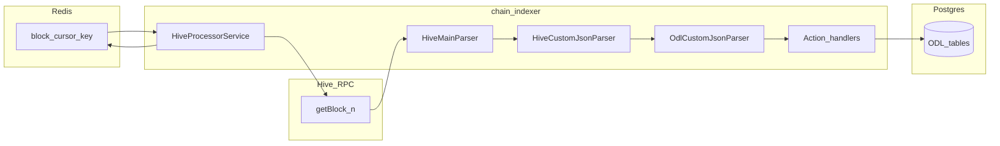

# chain-indexer

**Developer guide:** [developer guide](../developer-guide.md) (local setup, env, operations).

**Back:** [Documentation index](../../../README.md) · **Related:** [Services architecture](../../../architecture/overview.md), [Specification index](../../../spec/README.md), [Data model flow](../../../spec/data-model/flow.md)

## 1) Purpose

The **chain-indexer** application is the **Hive write path**: it reads blocks in order, extracts ODL (`custom_json`) events, validates them against domain registries, and persists **neutral** materialized state to PostgreSQL. It does **not** apply tenant- or request-scoped governance masking; that remains the query layer’s responsibility (see [architecture overview](../../../architecture/overview.md)).

## 2) Scope and stack

| Layer | Technology |
|-------|------------|
| Runtime | NestJS `ApplicationContext` (no HTTP server) |
| Chain access | `@hiveio/dhive` via `@opden-data-layer/clients` (`HiveClient`) |
| Block loop | `HiveProcessorService` in `@opden-data-layer/core` |
| Cursor | Redis (`BlockCacheService`) |
| Persistence | Kysely + PostgreSQL (app repositories under `apps/chain-indexer/src/repositories/`) |
| Large imports | Optional IPFS (`batch_import` → `BatchImportWorker`) |

## 3) Non-goals

- **No governance masking for API callers** — indexer stores canonical rows; filtering and masks are defined in domain specs and implemented in the query path.
- **Not a full Hive mirror** — only operations wired in `HiveMainParser` are processed (`custom_json` for ODL id and follow, `comment`, `delete_comment`, `vote`, `account_update`, `create_account`, `create_claimed_account`; see [social-parsers](social-parsers.md), [vote-ingestion](vote-ingestion.md)).

## 4) High-level data flow

## 5) Feature specs

| Feature | Description |
|---------|-------------|
| [Hive ingestion](hive-ingestion.md) | Sequential block loop, Redis cursor, `custom_json` routing, error handling |
| [Social parsers](social-parsers.md) | Hive follow / reblog / mute, account profile updates, minimal account rows |
| [ODL pipeline](odl-pipeline.md) | Envelope, actions, repositories, write guards, batch import |
| [Vote ingestion](vote-ingestion.md) | Hive `vote` → `post_active_votes` + `post_sync_queue`; worker fills `rshares` and ghost posts |

**Schema and migrations:** [Data model](../../../spec/data-model/flow.md), [Migrations](../../../operations/migrations.md).

## 6) Verification

| Command | Purpose |
|---------|---------|
| `pnpm nx serve chain-indexer` | Build and run the indexer (watch) |
| `pnpm nx build chain-indexer` | Production webpack build |
| `pnpm nx test chain-indexer` | Unit tests |
| `pnpm nx lint chain-indexer` | ESLint for `apps/chain-indexer` |

**Related code:** [`apps/chain-indexer/`](../../../../apps/chain-indexer/).
