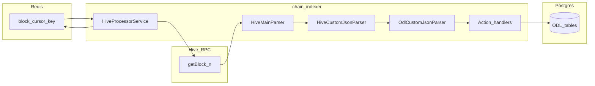

# chain-indexer

**Developer guide:** [developer guide](../developer-guide.md) (local setup, env, operations).

**Back:** [Documentation index](../../../README.md) · **Related:** [Services architecture](../../../architecture/overview.md), [Specification index](../../../spec/README.md), [Data model flow](../../../spec/data-model/flow.md)

## 1) Purpose

The **chain-indexer** application is the **Hive write path**: it reads blocks in order, extracts ODL (`custom_json`) events, validates them against domain registries, and persists **neutral** materialized state to PostgreSQL. It does **not** apply tenant- or request-scoped governance masking; that remains the query layer’s responsibility (see [architecture overview](../../../architecture/overview.md)).

## 2) Scope and stack

| Layer | Technology |
|-------|------------|
| Runtime | NestJS `ApplicationContext` (no HTTP server) |
| Chain access | `@hiveio/dhive` via `@opden-data-layer/clients` (`HiveClient`) |
| Block loop | `HiveProcessorService` in `@opden-data-layer/hive-processor` |
| Hive Engine | `HiveEngineProcessorService` + sub-parsers (`WaivStakeParser`, `WaivPostRewardParser`, `MarketpoolsSwapParser`); Redis cursor for Engine block number |
| Cursor | Redis (`BlockCacheService`) |
| Persistence | Kysely + PostgreSQL (app repositories under `apps/chain-indexer/src/repositories/`) |
| Large imports | Optional IPFS (`batch_import` → `BatchImportWorker`) |

## 3) Non-goals

- **No governance masking for API callers** — indexer stores canonical rows; filtering and masks are defined in domain specs and implemented in the query path.
- **Not a full Hive mirror** — only operations wired in `HiveMainParser` are processed (`custom_json` for ODL id, follow, and RC delegate, `comment`, `delete_comment`, `vote`, `account_update`, `account_update2`, `account_create`, `create_claimed_account`, `recover_account`, `delegate_vesting_shares`; see [social-parsers](social-parsers.md), [account-authority-grants](account-authority-grants.md), [vote-ingestion](vote-ingestion.md), [hive-delegations](hive-delegations.md)).

## 4) High-level data flow

```mermaid
flowchart LR
  subgraph redisLayer [Redis]
    cursorKey[block_cursor_key]
  end
  subgraph hiveRpc [Hive_RPC]
    getBlock[getBlock_n]
  end
  subgraph indexer [chain_indexer]
    proc[HiveProcessorService]
    hiveParser[HiveMainParser]
    cjParser[HiveCustomJsonParser]
    odlParser[OdlCustomJsonParser]
    handlers[Action_handlers]
  end
  subgraph pg [Postgres]
    odlTables[(ODL_tables)]
  end
  cursorKey --> proc
  proc --> getBlock
  getBlock --> hiveParser
  hiveParser --> cjParser
  cjParser --> odlParser
  odlParser --> handlers
  handlers --> odlTables
  proc --> cursorKey
```

## 5) Feature specs

| Feature | Description |
|---------|-------------|
| [Hive ingestion](hive-ingestion.md) | Sequential block loop, Redis cursor, `custom_json` routing, error handling |
| [Post languages](post-languages.md) | ELD detection on comment upsert → `post_languages` rows |
| [Post related images sync](post-object-related-images-sync.md) | `post_object_related_images` from post `json_metadata.image` + `post_objects` |
| [Social parsers](social-parsers.md) | Hive follow / reblog / mute, account profile updates, minimal account rows |
| [Account authority grants](account-authority-grants.md) | Hive `account_auths` reverse index → `user_account_auths` |
| [Wallet notifications](wallet-notifications.md) | Notify-only Hive L1 wallet ops → notification stream (no wallet history in PG) |
| [Hive delegations](hive-delegations.md) | HP `delegate_vesting_shares` and RC `custom_json` id `rc` → `user_delegations` / `user_rc_delegations` |
| [ODL pipeline](odl-pipeline.md) | Envelope, actions, repositories, write guards, batch import |
| [OBL parser](obl-parser.md) | Open Business Layer `custom_json` actions, mutual ledger, payments, disputes |
| [Vote ingestion](vote-ingestion.md) | Hive `vote` → `post_active_votes` + `post_sync_queue`; worker fills `rshares` and ghost posts |
| [Account sync](account-sync.md) | `account_sync_queue`: `get_accounts` + followers/following/muted backfill when account is missing or on create |
| [Meta group sync](meta-group-sync.md) | `meta_group_id` on `objects_core` synced from winning `group_id` via `ObjectViewService` + platform governance |
| [Object categories](object-categories.md) | Materialized `category` per object + scoped `object_categories_related` for shop navigation queues |
| [Object status](object-status.md) | `objects_core.status` materialized from vote-winning status updates + platform governance; `protected` is update-only; query-api exposes `active` only in discover/search |
| [WAIV post reward](waiv-post-reward.md) | Root-post WAIV fields from HE `comments` parser; reconcile + finalize in scheduler |
| [Hive Engine swaps](hive-engine-swaps.md) | Atomic `marketpools/swapTokens` rows in `hive_engine_swaps` from HE logs |
| [OSL parser](osl-parser.md) | Open Social Layer `custom_json` (`osl-mainnet` / `osl-testnet`); [`hive_engine_deposit`](osl-hive-engine-deposit.md) → `hive_engine_deposit_records`; [`update_user_notification_settings`](osl-user-notification-settings.md) → `user_notification_settings`; [`update_user_metadata`](osl-user-metadata.md) → `user_metadata` |

**WAIV voting weight:** [waiv-power.md](../../../spec/waiv-power.md) — `user_object_powers`, ODL-triggered create events, Hive Engine stake/delegate increments.

**Schema and migrations:** [Data model](../../../spec/data-model/flow.md), [Migrations](../../../operations/migrations.md).

## 6) Verification

| Command | Purpose |
|---------|---------|
| `pnpm nx serve chain-indexer` | Build and run the indexer (watch) |
| `pnpm nx build chain-indexer` | Production webpack build |
| `pnpm nx test chain-indexer` | Unit tests |
| `pnpm nx lint chain-indexer` | ESLint for `apps/chain-indexer` |

**Related code:** [`apps/chain-indexer/`](../../../../apps/chain-indexer/).
