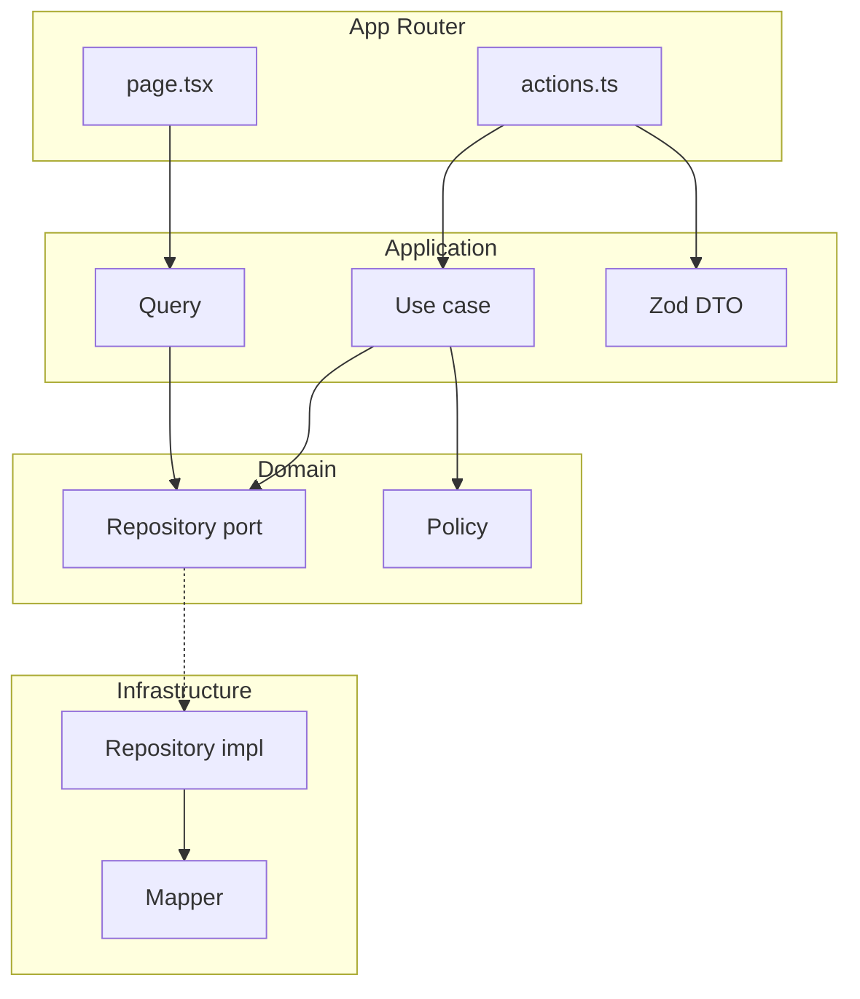

# web — application architecture

**Back:** [web overview](overview.md) · **Related:** [web conventions](web-conventions.md), [i18n](i18n.md), [theme](theme.md), [images](images.md)

Normative layout for feature code in `apps/web`. The App Router (`src/app/`) stays **thin**: route files orchestrate queries and server actions; domain and application logic live under `src/modules/` and `src/shared/`.

## Normative goals

- **Separation of concerns:** domain rules, orchestration (use cases / queries), I/O (HTTP, cookies), and UI are distinct.
- **Ports and adapters:** application code depends on **interfaces** (ports); infrastructure provides **implementations** (adapters). Swap REST, mock, or BFF without rewriting domain logic.
- **CQRS-lite:** **queries** (reads) and **commands** (writes via use cases) are separate entry points — different optimization and evolution paths.
- **Authentication vs authorization:** **Authentication** answers *who* the user is (session, cookies, tokens). **Authorization** answers *what* they may do (policies). Do not merge these into one “auth service.”
- **Composition without a DI container:** wire dependencies via **module-level factories** and **barrel exports**. No runtime IoC container (see [Composition](#composition-no-di-container)).

## Layer responsibilities

| Layer | Role | May import |
|-------|------|------------|
| **Domain** | Entities, value objects, invariants, **authorization policies** (pure rules), repository **interfaces** | `shared/domain`, `shared/application` (types only — e.g. `CurrentUser` for policies; no infrastructure) |
| **Application** | Queries, use cases, DTOs (Zod), orchestration, policy invocation | domain, `shared/*` |
| **Infrastructure** | Repository implementations, HTTP clients, mappers (API ↔ domain), cookie/session adapters | domain (types), application ports, `shared/*` |
| **Presentation** | React components (server/client), UI-only hooks | application (via public API), `shared/presentation` |

**Frontend “infrastructure”** means: fetch/HTTP, cookies/headers, browser APIs, cache helpers, external clients — **not** databases (this app is not a data layer).

## Module layout (`src/modules/<name>/`)

Each feature module owns its vertical slice:

| Path | Responsibility |
|------|----------------|
| `domain/entities/` | Entities and value objects |
| `domain/policies/` | Authorization policies (e.g. `PostsPolicy.canUpdate(user, post)`) |
| `domain/types.ts` | Module-specific domain types |
| `application/dto/` | Zod schemas and DTOs for inputs/outputs |
| `application/queries/` | Read-side services |
| `application/use-cases/` | Write-side commands |
| `infrastructure/repositories/` | Repository implementations |
| `infrastructure/mappers/` | Boundary mapping (API response ↔ domain) |
| `infrastructure/clients/` | External service clients |
| `presentation/components/` | Feature UI |
| `presentation/hooks/` | UI-only hooks (`'use client'`) |
| `index.ts` | **Public API** — only export what other modules or `app/` may use |

**Authorization policies** live **inside** the feature module (e.g. `posts/domain/policies/`), not in a separate top-level `authorization` module. Shared primitives (`CurrentUser`, `AuthContextProvider`) live in `shared/application/`.

## Shared (`src/shared/`)

Only **truly cross-cutting** code:

- `shared/domain` — `Result<T, E>`, base error shapes
- `shared/application` — auth context **interface**, `CurrentUser` type
- `shared/infrastructure` — shared fetch wrapper, auth adapters (add when first needed)
- `shared/presentation` — shared UI primitives and small helpers

Do **not** move feature-specific entities or repositories into `shared/` to avoid coupling.

## Existing modules (`i18n`, `theme`)

These remain at `src/i18n/` and `src/theme/`. They already follow a compatible split:

| Conceptual layer | `i18n` / `theme` paths |
|------------------|------------------------|
| Configuration | `config/` |
| Domain (pure) | `domain/` |
| Infrastructure | `runtime/` (cookies, request, loaders) |
| Presentation | `providers/`, feature components |

New modules use the canonical names `domain/`, `application/`, `infrastructure/`, `presentation/`.

## Composition (no DI container)

- Export **pre-composed** query services and use cases from the module barrel (`index.ts`), or expose small **factory functions** that take ports (e.g. `createGetPostQuery(deps)`).
- Server Components and server actions **import** from `@/modules/<name>` or `@/shared` — no `container.resolve()`.
- Rationale: App Router already scopes server work per request; DI containers add bundle cost and often conflict with Turbopack/metadata expectations for marginal gain in the UI tier.

## Module dependency rules

- Import other modules only via their **`index.ts`** (public API).
- **No circular dependencies** between modules. If two modules must interact, define a **port** in `shared/application` and implement it in infrastructure.
- `users` (or profile) data: other modules must not deep-import `modules/users/...`; they depend on **interfaces** or **queries** exposed from the users module’s public API.

## Data flow (summary)

1. **Read:** `page.tsx` (Server Component) → query in `application/queries` → repository (port) → infrastructure → mapper → domain types → props to presentation.
2. **Write:** `actions.ts` (`'use server'`) → Zod validate → use case → policy → repository → `revalidatePath` / `revalidateTag` as needed → return `Result` to the client.

## Typed results and errors

- Use **`Result<T, E>`** from `shared/domain` for **expected** failures (validation, forbidden, not found). Map `E` to UI in presentation.
- Use **exceptions** for unexpected faults (programmer errors, invariant violations). Use **Error Boundaries** for unexpected render failures.
- Each module defines its own **error code** union where needed; keep codes stable for API/UI mapping.

## App Router placement

- **`src/app/(public)/`** / **`(protected)/`** — route groups when routing requires different layouts or guards.
- **`page.tsx`** — async data loading, call queries, pass serializable props to screens.
- **`actions.ts`** — validate input, invoke use cases, revalidation, return serializable `Result`.

## Related code paths

| Path | Role |
|------|------|
| `apps/web/src/modules/` | Feature modules (add per feature) |
| `apps/web/src/shared/` | Cross-cutting types and interfaces |
| `apps/web/src/app/` | Routes only — thin wiring |

## Architecture diagram

## Verification

| Command | Purpose |
|---------|---------|
| `pnpm nx lint web` | ESLint |
| `pnpm nx test web` | Unit tests (including `shared/domain`) |
| `pnpm nx build web` | Production build |
