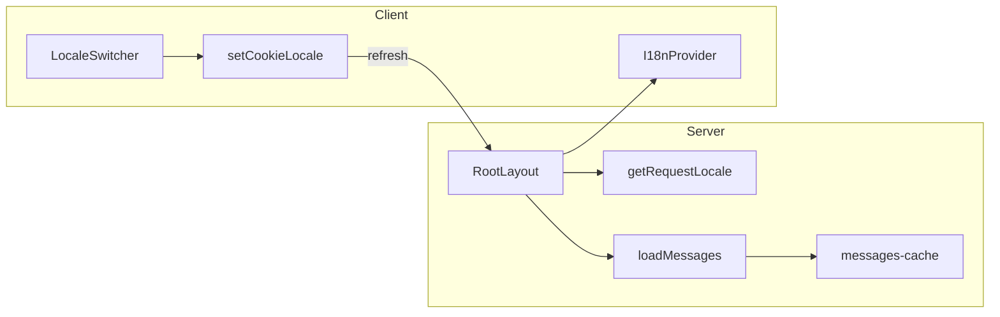

# i18n — framework-free internationalization

**Back:** [web overview](overview.md) · **Related:** [Getting started](../../../getting-started.md)

Lightweight, framework-free i18n layer with no third-party i18n library. Locale resolution, messages, and UI wiring live under `apps/web/src/i18n/`.

**Normative goals:**

- Resolve the active locale on the **server** (root layout) before paint — **not** by guessing locale on the client first.
- Persist user choice via HTTP cookie (`app_locale`), validated against configured locales.
- Lazy-load translation JSON **per locale** (explicit static imports only — no dynamic path segments).
- Avoid hydration mismatches by passing **preloaded** messages from the server into the client `I18nProvider`.

## Module layout

All i18n code lives under **`apps/web/src/i18n/`**:

| Area | Responsibility |
|------|----------------|
| `config/` | Source of truth: `locales` list, `DEFAULT_LOCALE` |
| `types/` | `LocaleId`, `LocaleConfig`, `Messages` |
| `domain/` | Pure functions: `resolveLocale`, `parseAcceptLanguage`, `resolveLocalePriority`, `isRTL` — **no** Next.js imports |
| `runtime/` | Request/cookies/messages: `getRequestLocale`, `getUserLocale`, `cookies`, `loadMessages`, `messages-cache` |
| `providers/` | Client `I18nProvider`, `useI18n()` |
| `components/` | `LocaleSwitcher` |
| `locales/*.json` | Flat string dictionaries (`common.hello`, ...) |

**Layering:** domain must not import runtime or UI; runtime may import domain + config; providers/components may import runtime + config + types.

## Locale resolution (priority)

`getRequestLocale()` (server) gathers:

1. **User locale** — `getUserLocale()` (placeholder; returns `null` until profile/auth is wired).
2. **Cookie** — `app_locale` raw value via `getCookieLocale()`.
3. **Headers** — `Accept-Language` parsed to an ordered list of tags.

It then calls **`resolveLocalePriority({ userLocale, cookieLocale, headerLocales })`**:

**Priority:** user -> cookie -> first **supported** Accept-Language candidate -> **`DEFAULT_LOCALE`** (`en-US`).

Unsupported or empty values are ignored at each step; matching uses **`matchLocale`** / config-driven variants (exact id, case-insensitive; language subtags when unambiguous).

## Cookies and server actions

| Name | Role |
|------|------|
| `app_locale` | Stores the selected `LocaleId` after validation (`matchLocale`). Set via **Server Action** `setCookieLocale` in `runtime/cookies.ts` (`'use server'`). |

Next.js requires `'use server'` modules to export **only async functions** — shared constants (e.g. cookie name) are not re-exported from that file.

**Locale switcher:** client calls `setCookieLocale`, then `router.refresh()` so the root layout re-executes and re-resolves locale server-side.

## Messages loading and SSR

- **`loadMessages(locale)`** uses a **fixed** `Record<LocaleId, () => Promise<Messages>>` of static imports — one entry per locale file under `locales/`.
- **`messages-cache`** holds an in-memory map to avoid duplicate imports per locale per process.
- **Root layout** awaits `getRequestLocale()` and `loadMessages(locale)`, then passes `locale` + `messages` into **`I18nProvider`**. The provider does **not** fetch messages on the client for the initial tree; `t(key)` reads the preloaded map (missing key -> returns the key).

## RTL

- **`isRTL(locale)`** reads the `rtl` flag from the **`locales`** config (no scattered locale string checks).
- Root layout sets `<html lang={locale} dir={dir}>` with `dir` from `isRTL`.

## Adding a new locale

1. Append an entry to **`src/i18n/config/locales.ts`** (`id`, `label`, `rtl`).
2. Add **`src/i18n/locales/<id>.json`** with the same keys as existing JSON files.
3. Add a **static** loader line to **`src/i18n/runtime/load-messages.ts`** for that `LocaleId`.

`LocaleId` is derived from the `locales` array; TypeScript will require the loader map to stay complete.

## Architecture

## Related code paths

| Path | Role |
|------|------|
| `apps/web/src/app/layout.tsx` | Async layout: locale, messages, `html` `lang`/`dir` |
| `apps/web/src/i18n/config/locales.ts` | Locale registry |
| `apps/web/src/i18n/runtime/get-request-locale.ts` | Orchestrates priority inputs |
| `apps/web/src/i18n/runtime/cookies.ts` | `getCookieLocale`, `setCookieLocale` |
