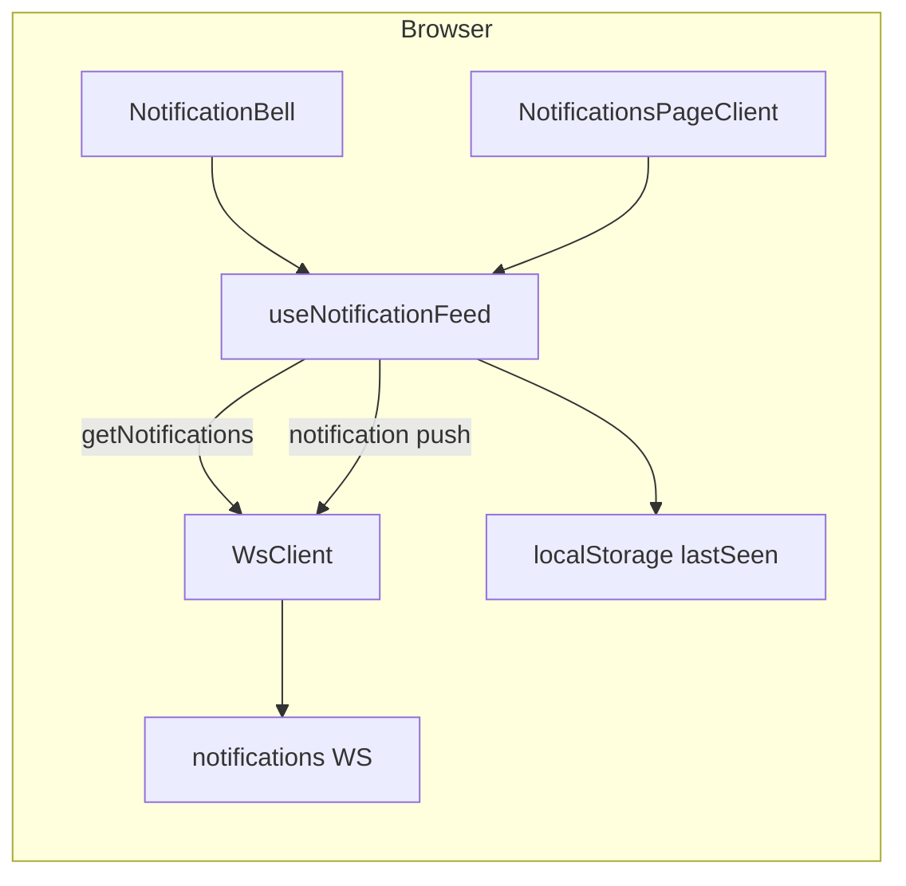

# Notifications UI

**Back:** [web overview](overview.md) · **Server transport:** [notifications transport](../../notifications/spec/transport.md)

## Purpose

Logged-in users see activity notifications in two places:

- **Header bell** — dropdown with up to 5 recent items, unread badge, link to full list.
- **`/notifications` page** — full feed (same row format). Unauthenticated visitors are redirected to `/`.

## Data flow

Implementation: [`apps/web/src/modules/notifications/`](../../../apps/web/src/modules/notifications/).

## WebSocket protocol (client)

Uses the shared [`NotificationsWsClient`](../../../apps/web/src/modules/notifications/infrastructure/notifications-ws-client.ts) (JWT via [`/api/auth/ws-token`](../../../apps/web/src/app/api/auth/ws-token/route.ts)).

| Direction | `event` | `data` |
|-----------|---------|--------|
| Client → server | `get_notifications` | `{ correlationId }` |
| Server → client | `get_notifications` | `{ correlationId, status: 'ok' \| 'error', items?: UserNotificationItem[], reason? }` |
| Server → client (push) | `notification` | `UserNotificationItem` (same shape as one list element) |

`UserNotificationItem`: `id`, `type`, `occurredAt` (ISO), `blockNum`, `trxId`, `objectId`, `actor`, `payload`.

Timeout for `get_notifications`: `GET_NOTIFICATIONS_TIMEOUT_MS` (10s) — returns `[]` on failure.

Env: `NEXT_PUBLIC_NOTIFICATIONS_WS_URL` (see [`apps/web/.env.example`](../../../apps/web/.env.example)).

## Unread tracking

- **Key:** `odl_notifications_last_seen_{username}` in `localStorage` (ISO timestamp).
- **Unread count:** items with `occurredAt` strictly after `lastSeen`; if no `lastSeen`, all loaded items count as unread.
- **`markRead()`:** writes `now` to localStorage and resets the counter.
- **Bell:** calls `markRead()` when the dropdown opens.
- **`/notifications` page:** calls `markRead()` on mount.

## i18n

Message text comes from locale JSON via [`format-notification.ts`](../../../apps/web/src/modules/notifications/domain/format-notification.ts):

| `type` | Message key |
|--------|-------------|
| `follow` | `notification_following_username` (`{username}` = actor) |
| `update_vote_cast` | `notification_upvoted_username_post` |
| other | `notification_generic_default_message` |

UI chrome: `notifications`, `notifications_empty_message`, `see_all`.

## Auth

[`apps/web/src/app/(app)/notifications/page.tsx`](../../../apps/web/src/app/(app)/notifications/page.tsx) uses `createCookieAuthContextProvider().getUser()`; missing session → `redirect('/')`.

## Verification

| Command | Purpose |
|---------|---------|
| `pnpm nx test web` | Unit tests (`format-notification`, `notification-feed-utils`, i18n guard) |
| `pnpm nx dev web` | Manual: log in, open bell, visit `/notifications` |

Manual smoke (with notifications service + Redis feed populated):

1. Set `NEXT_PUBLIC_NOTIFICATIONS_WS_URL` (e.g. `ws://localhost:7200/notifications` or nginx `/notifications`).
2. Log in; confirm bell shows badge when feed has items newer than last seen.
3. Open bell → badge clears; up to 5 rows + “See all”.
4. Open `/notifications` → full list; unauthenticated tab redirects home.
