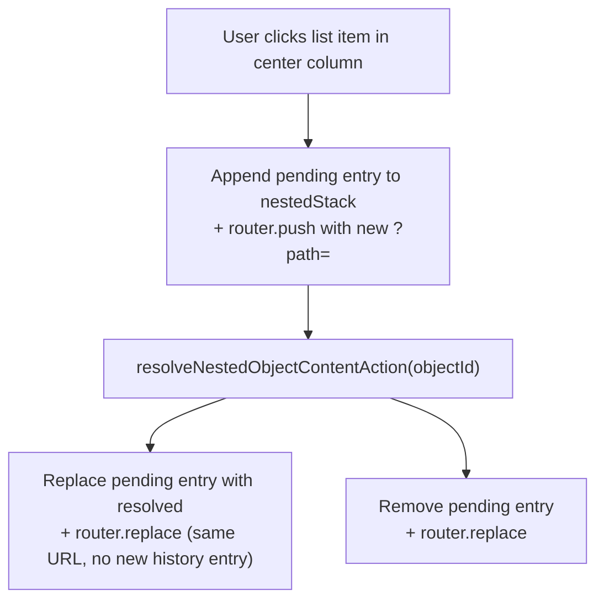
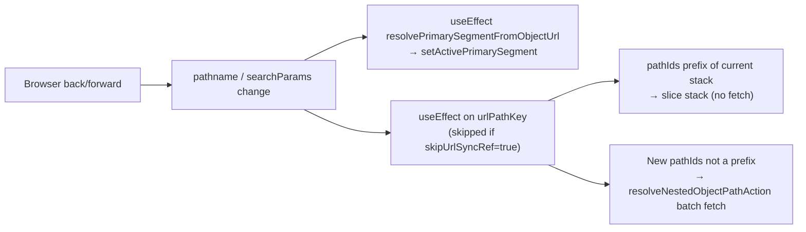

# Object page — navigation & transitions

**Back:** [web overview](../overview.md) · **Related:** [navigation.md](navigation.md), [right-rail.md](right-rail.md), [object-updates-feed.md](../object-updates-feed.md), [object-followers-feed.md](../object-followers-feed.md), [object-authority-feed.md](../object-authority-feed.md), [gallery.md](gallery.md)

## Scope

Covers all navigation behaviour on the object detail page (`/object/[object-id]`): URL routing, primary tab selection, nested catalog navigation, breadcrumb interaction, and browser history behaviour.

---

## 1. URL structure

| Visible URL | Meaning | Active tab |
|---|---|---|
| `/object/:id` | Default landing (see §4) — host content, SSR nested menu, or Reviews | none, or Reviews when `primaryTab: reviews` |
| `/object/:id?path=a,b` | User navigated nested stack `[a, b]` (not default SSR nested) | none |
| `/object/:id/reviews` | Reviews tab | Reviews |
| `/object/:id/updates` | Updates feed | Updates |
| `/object/:id/followers` | Followers list | Followers |
| `/object/:id/authority` | Authority list | Authority |
| `/object/:id/description` | Full description + gallery interleave | none |
| `/object/:id/gallery` | Gallery tab — albums grid | Gallery |
| `/object/:id/gallery/album/:name` | Gallery tab — album photo grid | Gallery |
| `/object/:id/experts` | Experts tab | Experts |
| `/object/:id/related` | Related objects feed | Related |
| `/object/:id/similar` | Similar objects feed | Similar |
| `/object/:id/add-on` | Add-on objects feed | Add-On |

**Right rail:** preview blocks for Related, Similar, Add-On, and Followers (when data exists) — see [right-rail.md](right-rail.md). Show more on each block opens the matching row above.

**Proxy rewrites** (`apps/web/src/proxy.ts`):

All `/object/:id/<tab>` paths are rewritten server-side to `/object/:id` with `?tab=<tab>` injected. Gallery album drill-down is rewritten to `?tab=gallery&gallery_album=<encoded-name>` (see [gallery.md](gallery.md)). A single App Router page (`page.tsx`) handles every variant.

**`?path=`** (`OBJECT_PAGE_VIEW_PATH_PARAM = 'path'`) holds a comma-separated list of nested object ids representing the current breadcrumb stack in the center column. Parsed by `apps/web/src/modules/object/domain/object-page-path.ts`.

---

## 2. Active tab resolution

On every URL change (including browser back/forward), `ObjectPageClient` calls `resolvePrimarySegmentForObjectPage` in `apps/web/src/app/(app)/object/[object-id]/object-page-search.ts`:

1. `resolvePrimarySegmentFromObjectUrl` — check `pathname` for `/object/:id/reviews|updates|followers|authority|description|gallery|gallery/album/:name|experts|related|similar|add-on`, then legacy `?tab=`.
2. If that returns a segment, use it (explicit tab in URL).
3. If `?path=` is present, use `''` (menu landing with user-driven nested stack).
4. Otherwise keep the SSR default tab from default landing (`initialPrimarySegment`) — e.g. Reviews on clean `/object/:id` without requiring `/reviews` in the path.

This preserves clean URLs for both default nested menu (`nestedInHost`) and default Reviews (`primaryTab: reviews`) on first load and back/forward to `/object/:id`.

---

## 3. Primary tab transitions

Implemented in `onPrimarySelect` in `apps/web/src/app/(app)/object/[object-id]/object-page-client.tsx`:

| Tab | Router method | Target URL | Params cleared |
|---|---|---|---|
| `reviews` | `push` | `/object/:id/reviews` | `?path=`, `?sub=` |
| `updates` | `replace` | `/object/:id/updates` | `?tab=`, `?sub=` |
| `followers` | `replace` | `/object/:id/followers` | `?tab=`, `?sub=` |
| `authority` | `replace` | `/object/:id/authority` | `?tab=` |
| `gallery` | `replace` | `/object/:id/gallery` | `?tab=`, `?sub=`, `sort`, `update_type`, `locale` |
| `experts` | `replace` | `/object/:id/experts` | `?tab=`, `?sub=`, `sort`, `update_type`, `locale` |
| Other | `replace` | `/object/:id?tab=<seg>` | `?tab=`, `?sub=`, `sort`, `update_type`, `locale` |

**History note:** `reviews` uses `router.push` so the menu landing remains reachable via browser back. All other tabs use `router.replace` (they do not add a history entry).

---

## 4. Center column content by segment

Managed in `apps/web/src/modules/object/presentation/components/object-primary-content.tsx`:

```
activePrimarySegment === ''   → Menu landing: shows defaultNestedContent or root listItems / page body
                                Breadcrumbs visible when nestedStack.length > 0
activePrimarySegment === 'reviews' → Reviews column (Write-review prompt + sub-nav for `default` type)
                                     No defaultNestedContent injected
activePrimarySegment === 'updates|followers|authority|…' → Respective feed/list injected
```

### Default landing resolution (clean `/object/:id`)

When the URL has **no** `?tab=` and **no** `?path=`, SSR derives tab + center column from `model.defaultLanding` (`resolveObjectDefaultLanding` in `apps/web/src/modules/object/domain/resolve-object-default-landing.ts`). Logic ports legacy object-processor `getLinkToPageLoad` / `getDefaultLink` / `getCustomSortLink` — see [`docs/spec/resolved-view-waivio-legacy.md`](../../../../spec/resolved-view-waivio-legacy.md) step I and `tmp/object-processor/src/index.ts`.

| `defaultLanding.kind` | Active tab (SSR) | Center column | URL |
|---|---|---|---|
| `hostContent` | none | Host `listItems` / `pageContent` / type stub | clean `/object/:id` |
| `nestedInHost` | none | SSR `defaultNestedContent` for `targetObjectId` | clean (no `?path=`) |
| `primaryTab` (`reviews`) | Reviews | Reviews UI | clean `/object/:id` |
| `primaryTab` (`description`) | Description | Description + gallery interleave | clean `/object/:id` |
| `routeStub` (`blog`, `newsFilter`) | Reviews (v1 fallback) | Reviews UI | clean — full routes **TODO** |

Priority (matches processor):

1. `sortCustom.include[0]` → menu / listItem / blog / newsFilter target
2. Host type (`list`, `page`, `widget`, `newsfeed`, `shop`, `webpage`, `map`, `group`, `html`) → `hostContent`
3. Business-like types (`business`, `restaurant`, `place`, …) → `getDefaultLink` chain: first `menuItem`, then legacy `listItem`, then `newsFilter` / `blog`, else reviews
4. When step 3 yields Reviews and `posts_count === 0` and description text or gallery exists → **Description** (legacy waivio [#5205](https://github.com/Waiviogit/waivio/issues/5205))
5. Other types → `primaryTab: reviews`

Explicit `?tab=` or `?path=` in the URL **overrides** default landing.

`defaultNestedContent` is resolved only when `defaultLanding.kind === 'nestedInHost'` and `activePrimarySegment === ''`.

### Description page (`/object/:id/description`)

Proxy rewrites to `?tab=description`. Center column uses `ObjectDescriptionBody`:

- Description text split into paragraphs (`\n\n` or HTML `<p>` blocks).
- Up to **15** photos from `model.previewGallery` (query-api `buildGalleryAlbums` — legacy `getGallery.js` / `preview_gallery`) interleaved after each paragraph; leftover photos appended at the bottom (legacy `DescriptionPage.js` #5485).
- Typography matches `ObjectPageBody` (page content styles).

Left rail **Description** button links here when description text or gallery preview exists. Gallery block shows `ObjectGalleryCarousel` (looped prev/next) from `previewGallery` **excluding avatar-only rows** — hidden when every preview photo is the object avatar.

**TODO:** related album photos from posts (legacy separate API — not in v1).

---

## 5. Nested catalog navigation (`?path=`)



- **Forward navigation** (click into list item): `router.push` → adds history entry.
- **Resolution complete**: `router.replace` → updates URL in-place, no duplicate history entry.
- **Failed resolution**: removes the pending entry, `router.replace`.

### `skipUrlSyncRef` guard

When `syncPathToUrl` fires a `router.push/replace`, `skipUrlSyncRef.current` is set `true` for one cycle. The `useEffect` watching `searchParams` skips the re-fetch on that cycle to avoid a feedback loop.

---

## 6. Breadcrumb navigation

Component: `apps/web/src/modules/object/presentation/components/object-center-breadcrumbs.tsx`

- Rendered **only** on menu landing (`activePrimarySegment === ''`) when `nestedStack.length > 0`.
- Segments: root object (depth `-1`) + each stack entry (depth `0..N-1`).
- Clicking a segment calls `navigateToDepth(depth)` → `router.push` with truncated `?path=` → adds history entry.
- Clicking the current (last) segment is not rendered as a button.

---

## 7. Browser back / forward



- Tab state always re-derived from URL — no stale React state after navigation.
- Nested stack: if the new `?path=` is a prefix of the current stack, it is sliced without a network call. Otherwise a batch fetch via `resolveNestedObjectPathAction` hydrates the full stack.

---

## 8. Left-rail menu links

Implemented in `apps/web/src/modules/object/presentation/components/object-menu-items-static.tsx`.

For menu items targeting objects of types in `MENU_IN_HOST_TYPES` (see `apps/web/src/modules/object/domain/object-menu.constants.ts`): link renders as `/object/:hostId?path=:targetId`. The target opens in the host object's center column.

For all other item types or external links: navigate directly to `/object/:targetId` or the external URL.

Legacy reference: `tmp/waivio-frontend-legacy/src/client/app/Sidebar/MenuItemButtons/MenuItemButton.js` (`list` → `/menu#`, `page` → `/page#`, default → `/object/:targetId`).

---

## 9. Legacy Waivio reference (`waivio-frontend-legacy`)

Source of truth for parity checks: `tmp/waivio-frontend-legacy/`.

### Active tab on first load (`ObjectMenu.js`)

| Host `object_type` | URL `/object/:name` (no tab segment) | Active tab |
|---|---|---|
| Special types: `list`, `page`, `html`, `widget`, `map`, `webpage`, `group`, `newsfeed`, `shop` | same | Host type (e.g. **List** for `list`) |
| Business-like (`business`, `restaurant`, `place`, …) | same | **Reviews** (`isObjectReviewTab` also treats bare `/object/:id` as reviews) |

Special types are derived in `ObjectMenu.js` (`isSpesialPage`); default tab param falls back to `reviews` for non-special hosts.

### Center column on first load (`WobjSwitcherPage.js`)

When the route has **no** tab segment (`path: ''` in `routes/configs/routes.js`):

| Host `object_type` | Center column component |
|---|---|
| `list` | `CatalogWrap` — host list items |
| `page`, `html` | `ObjectOfTypePage` |
| `newsfeed` | `ObjectFeed` |
| `widget`, `webpage`, `map`, `shop`, `group` | Respective type component |
| **default / business** | `ObjectReviewsAndThreads` — posts feed, **not** first menu item |

So on legacy **Waivio**, opening a business object does **not** auto-show the first menu list in the center; the user sees Reviews until they click a menu row.

### Menu item → center column (business host)

Left-rail menu rows (`ObjectInfo.getMenuSectionLink`, `MenuItemButton.js`):

| Menu target type | Legacy URL | Center content |
|---|---|---|
| `list` | `/object/:host/menu#:targetId` | `CatalogWrap` with nested list |
| `page` | `/object/:host/page#:targetId` | `ObjectOfTypePage` with nested page |
| `html`, `widget`, `webpage`, `map`, `newsfeed` | Type-specific path + hash | Nested content in host layout |
| Other (product, book, …) | `/object/:targetId` | Leaves host page |

Menu order follows `sortCustom.include`, then remaining `menuItem` rows (`sortListItems` in `common/helpers/wObjectHelper.js`).

### Social sites only (not Waivio main layout)

- `sortCustom.expand` auto-expands menu accordions inline (`BusinessObject.js` → `SocialMenuItems`).
- SSR prefetch of first sorted menu target (`WobjectContainer.fetchData` → `getMenuItemContent`) — store cache only; Waivio main site still renders Reviews on landing.

### Intentional differences in this app

| Topic | Legacy Waivio | This app |
|---|---|---|
| `defaultShowLink` API field | Computed by object-processor, used by cards/links | **Not exposed** — same logic in `resolveObjectDefaultLanding` |
| Business landing with nested menu | Processor URL `/menu#target`; UI sometimes showed Reviews on bare URL | `nestedInHost` + clean URL + menu landing tab state |
| Business landing with no menu | Reviews tab + posts feed | `primaryTab: reviews` on clean URL |
| Nested menu in host | `#hash` on `/menu`, `/page`, … | `?path=` stack when user navigates; default nested uses SSR only (clean URL) |
| List host landing tab | List tab active | No type-specific tab yet (center shows list items) |
| `blog` / `newsFilter` default | Dedicated routes | `routeStub` → reviews fallback until routes exist |

---

## Key files

| File | Role |
|------|------|
| `apps/web/src/proxy.ts` | Server-side URL rewrites |
| `apps/web/src/app/(app)/object/[object-id]/object-page-search.ts` | URL param parsing, `resolvePrimarySegmentFromObjectUrl`, `resolvePrimarySegmentForObjectPage` |
| `apps/web/src/modules/object/domain/object-page-path.ts` | `?path=` parsing helpers |
| `apps/web/src/modules/object/domain/build-description-page-blocks.ts` | Description paragraph split + photo interleave |
| `apps/web/src/modules/object/presentation/components/object-description-body.tsx` | SSR description page body |
| `apps/web/src/modules/object/presentation/components/object-gallery-carousel.tsx` | Left-rail looped gallery carousel |
| `apps/query-api/src/domain/object-projection/build-gallery-albums.ts` | Album formation + `previewGallery` (legacy `getGallery.js`) |
| `apps/web/src/modules/object/domain/resolve-object-default-landing.ts` | Default landing resolver (legacy `defaultShowLink` logic) |
| `apps/web/src/modules/object/domain/object-menu.constants.ts` | `MENU_IN_HOST_TYPES`, `isMenuInHostTargetType` |
| `apps/web/src/modules/object/infrastructure/projected-object-to-page-model.ts` | Builds `defaultLanding` on view model |
| `apps/web/src/app/(app)/object/[object-id]/object-page-client.tsx` | Primary tab selection and URL sync |
| `apps/web/src/modules/object/presentation/components/object-primary-content.tsx` | Center column rendering and nested stack state |
| `apps/web/src/modules/object/presentation/components/object-center-breadcrumbs.tsx` | Breadcrumb component |
| `apps/web/src/modules/object/presentation/components/object-menu-items-static.tsx` | Left-rail menu item links |
| `apps/web/src/modules/object/application/actions/resolve-nested-object-content.action.ts` | Single-item server action |
| `apps/web/src/modules/object/application/actions/resolve-nested-object-path.action.ts` | Batch path server action |

## Verification

- Manual: open `/object/:id`, drill into nested list items, use breadcrumbs and browser back/forward — tab highlight and center column must match URL at each step.
- Manual: select Reviews tab, press browser back — must return to menu landing with no tab highlighted.
- Manual: business with first in-host menu item — center shows nested list on clean URL; business with only external menu target — Reviews tab + reviews content.
- Manual: object with gallery items — left rail carousel loops with prev/next; `/object/:id/description` shows interleaved text + photos.
- Unit: `pnpm nx test web --testPathPatterns=build-description-page-blocks`
- Unit: `pnpm nx test query-api --testPathPatterns=build-gallery-albums`
