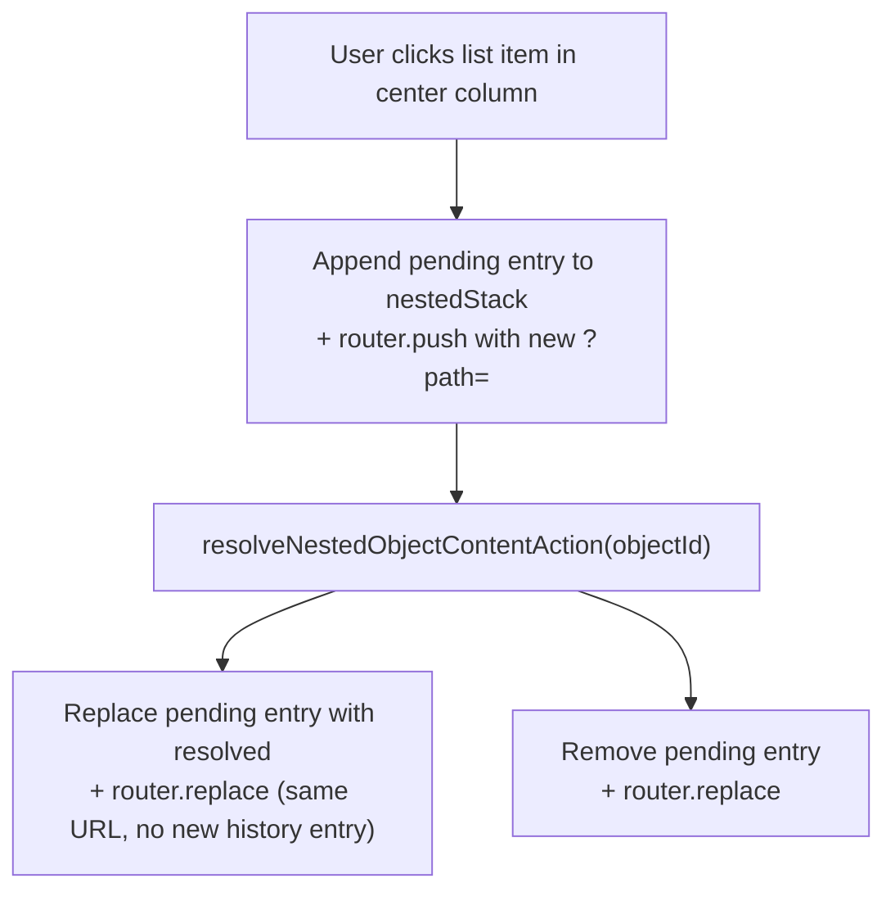
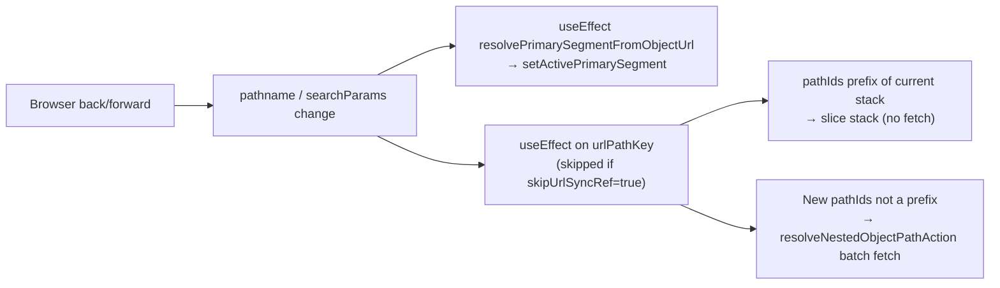

# Object page — navigation & transitions

**Back:** [web overview](../overview.md) · **Related:** [object-updates-feed.md](../object-updates-feed.md), [object-followers-feed.md](../object-followers-feed.md), [object-authority-feed.md](../object-authority-feed.md)

## Scope

Covers all navigation behaviour on the object detail page (`/object/[object-id]`): URL routing, primary tab selection, nested catalog navigation, breadcrumb interaction, and browser history behaviour.

---

## 1. URL structure

| Visible URL | Meaning | Active tab |
|---|---|---|
| `/object/:id` | Menu landing | none |
| `/object/:id?path=a,b` | Menu landing, nested stack `[a, b]` | none |
| `/object/:id/reviews` | Reviews tab | Reviews |
| `/object/:id/updates` | Updates feed | Updates |
| `/object/:id/followers` | Followers list | Followers |
| `/object/:id/authority` | Authority list | Authority |

**Proxy rewrites** (`apps/web/src/proxy.ts`):

All `/object/:id/<tab>` paths are rewritten server-side to `/object/:id` with `?tab=<tab>` injected. A single App Router page (`page.tsx`) handles every variant.

**`?path=`** (`OBJECT_PAGE_VIEW_PATH_PARAM = 'path'`) holds a comma-separated list of nested object ids representing the current breadcrumb stack in the center column. Parsed by `apps/web/src/modules/object/domain/object-page-path.ts`.

---

## 2. Active tab resolution

On every URL change (including browser back/forward), `resolvePrimarySegmentFromObjectUrl` in `apps/web/src/app/(app)/object/[object-id]/object-page-search.ts` derives the active segment:

1. Check `pathname` against `/object/:id/reviews|updates|followers|authority`.
2. Fall back to `?tab=` search param.
3. Return `''` (empty string) for the menu landing — no tab highlighted.

`ObjectPageClient` runs this in a `useEffect` on `[pathname, searchParams]` to keep the highlighted tab in sync on back/forward.

---

## 3. Primary tab transitions

Implemented in `onPrimarySelect` in `apps/web/src/app/(app)/object/[object-id]/object-page-client.tsx`:

| Tab | Router method | Target URL | Params cleared |
|---|---|---|---|
| `reviews` | `push` | `/object/:id/reviews` | `?path=`, `?sub=` |
| `updates` | `replace` | `/object/:id/updates` | `?tab=`, `?sub=` |
| `followers` | `replace` | `/object/:id/followers` | `?tab=`, `?sub=` |
| `authority` | `replace` | `/object/:id/authority` | `?tab=` |
| Other | `replace` | `/object/:id?tab=<seg>` | `?tab=`, `?sub=`, `sort`, `update_type`, `locale` |

**History note:** `reviews` uses `router.push` so the menu landing remains reachable via browser back. All other tabs use `router.replace` (they do not add a history entry).

---

## 4. Center column content by segment

Managed in `apps/web/src/modules/object/presentation/components/object-primary-content.tsx`:

```
activePrimarySegment === ''   → Menu landing: shows defaultNestedContent or root listItems
                                Breadcrumbs visible when nestedStack.length > 0
activePrimarySegment === 'reviews' → Reviews column (Write-review prompt + sub-nav for `default` type)
                                     No defaultNestedContent injected
activePrimarySegment === 'updates|followers|authority|…' → Respective feed/list injected
```

`defaultNestedContent` (first menu target pre-resolved on the server) is **only** used when `activePrimarySegment === ''` and `nestedStack` is empty.

---

## 5. Nested catalog navigation (`?path=`)



- **Forward navigation** (click into list item): `router.push` → adds history entry.
- **Resolution complete**: `router.replace` → updates URL in-place, no duplicate history entry.
- **Failed resolution**: removes the pending entry, `router.replace`.

### `skipUrlSyncRef` guard

When `syncPathToUrl` fires a `router.push/replace`, `skipUrlSyncRef.current` is set `true` for one cycle. The `useEffect` watching `searchParams` skips the re-fetch on that cycle to avoid a feedback loop.

---

## 6. Breadcrumb navigation

Component: `apps/web/src/modules/object/presentation/components/object-center-breadcrumbs.tsx`

- Rendered **only** on menu landing (`activePrimarySegment === ''`) when `nestedStack.length > 0`.
- Segments: root object (depth `-1`) + each stack entry (depth `0..N-1`).
- Clicking a segment calls `navigateToDepth(depth)` → `router.push` with truncated `?path=` → adds history entry.
- Clicking the current (last) segment is not rendered as a button.

---

## 7. Browser back / forward



- Tab state always re-derived from URL — no stale React state after navigation.
- Nested stack: if the new `?path=` is a prefix of the current stack, it is sliced without a network call. Otherwise a batch fetch via `resolveNestedObjectPathAction` hydrates the full stack.

---

## 8. Left-rail menu links

Implemented in `apps/web/src/modules/object/presentation/components/object-menu-items-static.tsx`.

For menu items targeting objects of types in `MENU_IN_HOST_TYPES` (`list`, `page`, `html`, `newsfeed`, `widget`, `webpage`, `map`): link renders as `/object/:hostId?path=:targetId`. The target opens in the host object's center column.

For all other item types or external links: navigate directly to `/object/:targetId` or the external URL.

---

## Key files

| File | Role |
|------|------|
| `apps/web/src/proxy.ts` | Server-side URL rewrites |
| `apps/web/src/app/(app)/object/[object-id]/object-page-search.ts` | URL param parsing and `resolvePrimarySegmentFromObjectUrl` |
| `apps/web/src/modules/object/domain/object-page-path.ts` | `?path=` parsing helpers |
| `apps/web/src/modules/object/domain/object-page-url.constants.ts` | Param name constants |
| `apps/web/src/app/(app)/object/[object-id]/object-page-client.tsx` | Primary tab selection and URL sync |
| `apps/web/src/modules/object/presentation/components/object-primary-content.tsx` | Center column rendering and nested stack state |
| `apps/web/src/modules/object/presentation/components/object-center-breadcrumbs.tsx` | Breadcrumb component |
| `apps/web/src/modules/object/presentation/components/object-menu-items-static.tsx` | Left-rail menu item links |
| `apps/web/src/modules/object/application/actions/resolve-nested-object-content.action.ts` | Single-item server action |
| `apps/web/src/modules/object/application/actions/resolve-nested-object-path.action.ts` | Batch path server action |

## Verification

- Manual: open `/object/:id`, drill into nested list items, use breadcrumbs and browser back/forward — tab highlight and center column must match URL at each step.
- Manual: select Reviews tab, press browser back — must return to menu landing with no tab highlighted.
- Manual: left-rail menu links for in-host types open target in center column via `?path=`.
