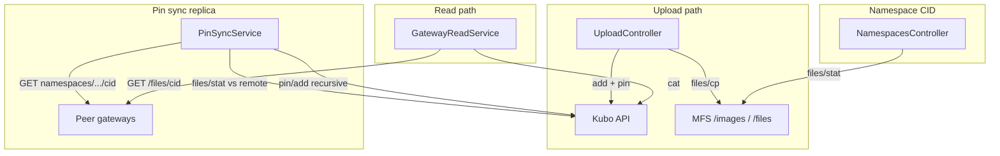

# IPFS Gateway

**Back:** [Developer documentation](README.md) · **Related:** [storage](../spec/storage.md), [overflow-strategy](../spec/overflow-strategy.md), [architecture](../spec/architecture.md)

## Local development

### Prerequisites

- Node.js ≥ 20, pnpm (see [dev-environment.md](dev-environment.md))
- A **Kubo** node with HTTP API enabled (default `http://localhost:5001`)

### Running Kubo

Use an official Kubo release or Docker image. The gateway expects the **HTTP API** at `IPFS_API_URL` (default `http://localhost:5001`).

Example (Docker — align the image tag with [docker-compose.yml](../docker-compose.yml) in this repo):

```bash
docker run -d --name kubo -p 4001:4001 -p 5001:5001 -p 8080:8080 ipfs/kubo:v0.40.1
```

Verify the API responds:

```bash
curl -X POST "http://localhost:5001/api/v0/version"
```

### Start the app

From the workspace root:

```bash
pnpm nx serve ipfs-gateway
```

Production build:

```bash
pnpm nx build ipfs-gateway
```

OpenAPI: `http://localhost:3001/ipfs-gateway/docs` (with default `PORT`).

### Verify behaviour

- **Logs:** On startup with peers, look for `Pin sync enabled`. When peers are empty: `Pin sync disabled`.
- **Namespace CIDs:** `curl http://localhost:3001/ipfs-gateway/namespaces/images/cid` and `curl http://localhost:3001/ipfs-gateway/namespaces/files/cid`
- **Lint/build:** `pnpm nx lint ipfs-gateway` and `pnpm nx build ipfs-gateway`

| Command | Description |
|---------|-------------|
| `pnpm nx serve ipfs-gateway` | Dev server with watch |
| `pnpm nx build ipfs-gateway` | Production webpack build |
| `pnpm nx lint ipfs-gateway` | ESLint |

---

## 1) Purpose

The **ipfs-gateway** application is a controlled HTTP layer in front of a Kubo (go-ipfs) node. It does **not** expose the full Kubo HTTP API (`/api/v0/*`) to clients.

**Normative goals:**

- Restrict the write surface to validated operations (multipart image upload, streaming file upload).
- Convert uploaded images to WebP via Sharp before pinning.
- Use deterministic filenames derived from SHA-256 of content (`{sha256}.{ext}`) for deduplication-friendly naming.
- Expose read-by-CID and namespace-directory-CID discovery for integrators and replica nodes.

Future extensions (e.g. API keys) apply at this gateway layer without changing Kubo’s public exposure model.

## 2) MFS namespaces

Kubo’s **Mutable File System (MFS)** holds logical directories separate from the raw blockstore. This gateway uses two fixed roots:

| MFS path | Purpose |
|----------|---------|
| `/images` | WebP blobs after `POST /upload/image` |
| `/files` | Arbitrary blobs after `POST /upload/file` (streaming upload) |

**On startup**, `MfsInitService` ensures these directories exist (`files/mkdir` with parents).

**On each successful upload**, after `add` (which pins the blob), the gateway copies the same CID into MFS via `files/cp` (source `/ipfs/{cid}`, destination `/images/{filename}` or `/files/{filename}`). No duplicate data is stored; MFS entries reference the pinned block.

**Discovery:** `GET /ipfs-gateway/namespaces/{namespace}/cid` with `namespace` in `images` | `files` returns `{ namespace, cid }` where `cid` is the MFS directory root for that subtree (`files/stat` on `/images` or `/files`). Other nodes use this CID for bulk recursive pinning.

## 3) Peer sync (PinSyncService)

Optional **replica** behaviour. If `IPFS_PEER_URLS` is unset or empty, **no** sync runs.

When configured (comma-separated base URLs of peer gateways, e.g. `http://node-a:3001/ipfs-gateway,http://node-b:3001/ipfs-gateway`):

1. On startup and on a fixed interval (`PIN_SYNC_INTERVAL_MS`, default 300000 ms), for each namespace `images` and `files`:
2. **Fetch** remote directory CID: `GET {peer}/namespaces/{namespace}/cid` — peers are tried **in order**; first successful response wins.
3. **Compare** with local `files/stat` on `/images` or `/files`.
4. If remote CID ≠ local CID, **`pin/add` recursive** on the local Kubo for the remote directory CID so blocks are pulled into the local repo.

**Note:** Pinning updates the local blockstore and pinset. Local MFS roots may still differ from the master until MFS is updated locally; content is still retrievable by CID. Operators should treat the master as source of truth for namespace directory CIDs when coordinating replication.

## 4) Read fallback (GatewayReadService)

All read routes below stream bytes for a CID using the same logic:

1. **First** try local Kubo `cat` (HTTP API from the gateway process to `IPFS_API_URL`).
2. If that fails **and** `IPFS_PEER_URLS` is non-empty, try each peer in order: `GET {peer}/files/{cid}` (raw download path used for peer fallback).

No Redis or external load balancer is required for this fallback; it is sequential HTTP inside the gateway.

| Route | Role |
|-------|------|
| `GET /files/{cid}` | Raw bytes; `Content-Type: application/octet-stream` (download / programmatic use). |
| `GET /content/image/{cid}` | Same bytes with `Content-Type: image/webp` and `Content-Disposition: inline` for browser display. |

## 5) Configuration

| Variable | Required | Default | Description |
|----------|----------|---------|-------------|
| `PORT` | No | `3001` | HTTP listen port for the Nest app |
| `IPFS_API_URL` | No | `http://localhost:5001` | Kubo HTTP API base URL |
| `IPFS_GATEWAY_URL` | No | — | Public URL of an IPFS **HTTP gateway** (e.g. for `url` fields in upload responses) |
| `IPFS_PEER_URLS` | No | — | Comma-separated peer **ipfs-gateway** base URLs (include path prefix `/ipfs-gateway` if used) |
| `PIN_SYNC_INTERVAL_MS` | No | `300000` | Interval between pin-sync cycles when peers are set |

Peer URLs must include the **global path prefix** if your deployment uses it (e.g. `/ipfs-gateway`).

## 6) HTTP API (global prefix)

All routes are under the global prefix **`/ipfs-gateway`** (see `main.ts`).

| Method | Path | Description |
|--------|------|-------------|
| `POST` | `/upload/image` | Multipart field `file`; max **50 MiB** per file; image converted to WebP, pinned, copied into MFS `/images/` |
| `POST` | `/upload/file` | Raw body `application/octet-stream`; streamed to IPFS (large files), optional `?filename=`; copied into MFS `/files/` |
| `GET` | `/files/{cid}` | Stream object by CID as octet-stream (local first, then peer fallback via `/files/{cid}` on peers) |
| `GET` | `/content/image/{cid}` | Same object as WebP with inline disposition (browser-friendly, CDN-cacheable) |
| `GET` | `/namespaces/{namespace}/cid` | `namespace` ∈ `images` \| `files`; returns directory CID for bulk pin |

OpenAPI/Swagger is served at `/ipfs-gateway/docs` when the app is running.

## 7) Architecture diagram



## 8) Caching guidance

CID-addressed content is **immutable** by definition (the same CID always resolves to the same bytes). Use aggressive cache headers on immutable read routes:

```
Cache-Control: public, max-age=31536000, immutable
```

| Endpoint | Caching | Reason |
|----------|---------|--------|
| `GET /files/{cid}` | `public, max-age=31536000, immutable` | CID = content hash; content never changes |
| `GET /content/image/{cid}` | Same | Typed response for images; URL encodes intent for CDN cache keys |
| `GET /namespaces/{ns}/cid` | `no-cache` or short `max-age` | Directory CID changes on every new upload |
| `POST /upload/*` | Not cacheable | Mutating requests |

When deploying behind a CDN (Cloudflare, Nginx, etc.), point `IPFS_GATEWAY_URL` at the CDN domain so upload responses return CDN-accelerated URLs directly (e.g. `https://cdn.example.com/ipfs/{cid}`).

## 9) Informative: relation to overflow storage

The indexer and overflow pipeline may reference IPFS CIDs for large payloads. This gateway is the **operational** ingress and coordination layer for **images** and **files** namespaces used by the platform; the exact linkage to Hive/overflow events is defined in [storage](../spec/storage.md) and [overflow-strategy](../spec/overflow-strategy.md).

---

See also the spec-tree document [spec/ipfs-gateway.md](../spec/ipfs-gateway.md) (linked from the spec index).
