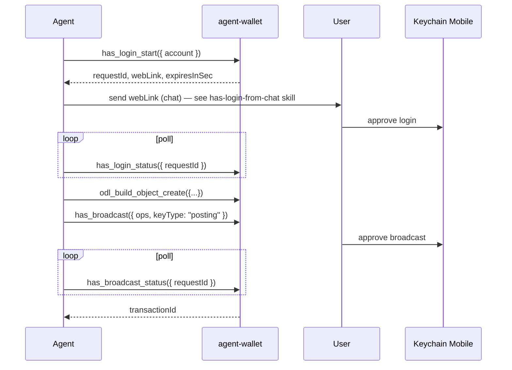

# HAS agent wallet (local MCP daemon)

Local NestJS daemon (`apps/agent-wallet`) that holds a **HAS session** (not private keys) and exposes MCP tools for login, ODL envelope build, and broadcast with **Keychain Mobile** approval.

**Prerequisite:** Hive account + Keychain (or compatible PKSA) on phone — see [Hive account signup](hive-account-signup.md).

## When to use

- Autonomous agent (Cursor, shell) must broadcast ODL txs **without** session posting keys.
- User approves each login and each broadcast on phone (or auto-approve rules in Keychain).
- Agent builds `object_create` envelopes via MCP instead of copying web form logic.

## When not to use

- Interactive browser session — use web wallets (Keychain extension, HiveAuth in browser).
- User explicitly wants **session posting key** automation — see [hive-blockchain-broadcast § B](hive-blockchain-broadcast.md#b-hiveiodhive-script--agent-with-session-posting-key).
- **Encrypted OSL messages** — HAS cannot sign memo keys; use `AGENT_WALLET_SIGNING_MODE=local` + `HIVE_MEMO_KEY` per [osl-messaging.md](osl-messaging.md).
- Hosted/multi-user signing service — out of scope; this daemon is **localhost only**.

## Security model

| Property | Value |
|----------|--------|
| Bind | `127.0.0.1:7500` only |
| CORS | **disabled** — browser pages cannot call the daemon |
| MCP auth | `Authorization: Bearer <token>` on every request |
| Token file | `~/.odl/agent-wallet.token` mode `0600` (generated on first start) |
| Session file | `~/.odl/agent-wallet-session.json` mode `0600` — contains `auth_key` + `token` (**secret**) |
| Accounts file | `~/.odl/accounts.json` — local Hive WIF keys (preferred over env) |
| Waivio auth | `~/.odl/waivio-auth/<account>.json` per account — refresh token only |
| Keys on phone | User private keys never leave Keychain; agent holds HAS session material only |

## Quick start

**Requirements:** Node.js 20+ (uses global `crypto.randomUUID()`).

### Option A — single-file release (recommended)

```bash
curl -Lo agent-wallet.js \
  https://github.com/Waiviogit/open-data-layer/releases/latest/download/agent-wallet.js
curl -Lo agent-wallet.js.sha256 \
  https://github.com/Waiviogit/open-data-layer/releases/latest/download/agent-wallet.js.sha256
sha256sum -c agent-wallet.js.sha256   # POSIX — verify before running
node agent-wallet.js
```

PowerShell:

```powershell
Invoke-WebRequest -Uri https://github.com/Waiviogit/open-data-layer/releases/latest/download/agent-wallet.js -OutFile agent-wallet.js
node agent-wallet.js
```

**Preferred:** register agent-wallet as an MCP server — see [MCP client setup](../apps/agent-wallet/spec/mcp-client-setup.md) (Cursor `.cursor/mcp.json`, Claude, Codex, Hermes). Read the bearer token from `~/.odl/agent-wallet.token` and paste it into the config headers (or pin with `AGENT_WALLET_BEARER_TOKEN`).

**Fallback:** raw JSON-RPC via `curl` or `Invoke-RestMethod` when the agent cannot add MCP servers — see [Fallback: raw JSON-RPC](#fallback-raw-json-rpc) below.

### Option B — from monorepo checkout

For agents that already cloned the repo per [setup-workspace.md](setup-workspace.md):

```bash
pnpm install
pnpm nx serve agent-wallet
```

On first start the daemon prints and writes the bearer token. Read it:

```bash
# POSIX
cat ~/.odl/agent-wallet.token

# Windows (PowerShell)
Get-Content $env:USERPROFILE\.odl\agent-wallet.token
```

MCP endpoint: `POST http://127.0.0.1:7500/agent-wallet/mcp`

Optional env (see [agent-wallet overview](../apps/agent-wallet/spec/overview.md)):

| Variable | Default |
|----------|---------|
| `PORT` | `7500` |
| `HOST` | `127.0.0.1` |
| `ODL_NETWORK` | `testnet` → `odl-testnet` |
| `HAS_WS_URL` | `wss://hive-auth.arcange.eu` |
| `HAS_WEB_LINK_BASE` | `https://waiviodev.com` — origin for clickable `webLink` in chat; set empty to disable |
| `AGENT_WALLET_NO_PERSIST` | `false` — set `true` for memory-only session |

## Agent workflow



### 1. MCP initialize

If registered as an MCP server, call tools directly (`wallet_status`, `odl_build_object_create`, `wallet_broadcast`, …). Do not shell out to curl or Python.

### Fallback: raw JSON-RPC

When MCP registration is not available, send JSON-RPC to `POST http://127.0.0.1:7500/agent-wallet/mcp` with bearer header. **Required:** `Accept: application/json, text/event-stream` — omitting `text/event-stream` returns **406**. Use `curl` or PowerShell `Invoke-RestMethod` only; never a Python or Node scratch script.

POSIX:

```bash
TOKEN=$(cat ~/.odl/agent-wallet.token)
curl -s http://127.0.0.1:7500/agent-wallet/mcp \
  -H "Authorization: Bearer $TOKEN" \
  -H "Content-Type: application/json" \
  -H "Accept: application/json, text/event-stream" \
  -d '{"jsonrpc":"2.0","id":1,"method":"tools/list","params":{}}'
```

PowerShell:

```powershell
$token = Get-Content $env:USERPROFILE\.odl\agent-wallet.token -Raw
$body = '{"jsonrpc":"2.0","id":1,"method":"tools/list","params":{}}'
Invoke-RestMethod -Uri http://127.0.0.1:7500/agent-wallet/mcp `
  -Method Post `
  -Headers @{
    Authorization = "Bearer $($token.Trim())"
    Accept = "application/json, text/event-stream"
    "Content-Type" = "application/json"
  } `
  -Body $body
```

Tool names:

| Tool | Purpose |
|------|---------|
| `has_login_start` | Start HAS auth; returns `requestId`, `alreadyActive`, `expiresAt`, `expiresInSec`, `pushSent`, `webLink`; `deepLink` only when no web link is configured |
| `has_login_status` | Poll: `pending` / `active` / `rejected` / `expired` |
| `has_login_qr` | Fallback artefacts for a pending login: `deepLink`, `qrAscii`, optional `qrPngPath` |
| `has_session` | `{ active, session: { account, expiresAt } }` — no secrets |
| `has_logout` | Clear session + session file |
| `odl_build_object_create` | Build `custom_json` ops for **new** objects only (always includes `object_create`); returns `requiresIpfsBatch` + `envelopeJson` when payload cannot fit on chain |
| `odl_build_update_create` | Build single `update_create` op for an **existing** object; returns `requiresIpfsBatch` + `envelopeJson` when one event exceeds 8192 bytes |
| `odl_build_gallery_item` | Build `imageGalleryItem` op for an **existing** object (album ensure when needed) |
| `ipfs_upload_file` | Upload ODL envelope JSON (inline `content` or `filePath`); max **10 MiB**; returns `{ cid }` |
| `odl_build_batch_import` | Build one `batch_import` op referencing an IPFS CID from `ipfs_upload_file` |
| `has_broadcast` | Start sign flow; returns `requestId` |
| `has_broadcast_status` | Poll: `pending` / `signed` / `rejected` / `error` / `expired` |

### 2. Login

**Chat / Telegram / Slack:** follow [has-login-from-chat](has-login-from-chat.md) — send `webLink` verbatim and nothing else. `deepLink` and `qrAscii` are base64 of JSON, so they start with `eyJ` and chat clients redact them as leaked JWTs.

```json
// tools/call has_login_start
{ "account": "alice" }
```

Terminal / second device: call `has_login_qr` with the `requestId` and show `qrAscii`, or open `deepLink`. Poll `has_login_status` until `active`.

Repeating `has_login_start` for the same account returns the existing pending request while it is still alive, so retries do not invalidate a link already sent.

### 3. Build object create (new objects only)

```json
// tools/call odl_build_object_create
{
  "objectType": "recipe",
  "objectId": "recipe-demo-1",
  "creator": "alice",
  "fields": [
    { "updateType": "name", "value": "Borscht" },
    { "updateType": "description", "value": "Beet soup" }
  ]
}
```

Uses `UPDATE_REGISTRY` Zod schemas (not web form validators). Returns `ops`, `opsCount`, `bytes`, `perOpBytes`, `warnings`, `suggestIpfsBatch`, and `requiresIpfsBatch` when the envelope cannot fit in direct `custom_json` ops.

**Do not use** when the object already exists.

When `requiresIpfsBatch` is true, `ops` is empty — use the IPFS batch recipe below instead of broadcasting oversize `custom_json`.

### 4. Update existing object (one field)

```json
// tools/call odl_build_update_create
{
  "objectId": "recipe-butter-garlic-naan-tawa",
  "creator": "alice",
  "updateType": "image",
  "value": { "cid": "Qm..." }
}
```

Returns `ops` with a single `update_create` event (no `object_create`). **Do not** follow with `update_vote` — chain-indexer auto-approves the creator's update.

When `requiresIpfsBatch` is true (large `pageContent`, `skillContent`, `legalText`, …), do **not** broadcast the returned op — use the IPFS batch recipe.

### 5. IPFS batch overflow (`requiresIpfsBatch`)

When `odl_build_object_create` or `odl_build_update_create` returns `requiresIpfsBatch: true`:

1. `ipfs_upload_file({ content: envelopeJson, account })` → `{ cid }`
2. `odl_build_batch_import({ account, cid })` → `{ ops }`
3. `wallet_broadcast` / `has_broadcast` with those ops

Never broadcast an oversize `custom_json` directly. Indexer replays child events from the IPFS file via `batch_import`. See [ipfs-file-upload.md](ipfs-file-upload.md).

### 6. Gallery item on existing object

```json
// tools/call odl_build_gallery_item
{
  "objectId": "recipe-butter-garlic-naan-tawa",
  "creator": "alice",
  "itemValue": { "album": "Photos", "cid": "Qm..." },
  "existingGalleryAlbumNames": ["Menu", "Photos"]
}
```

Pass album names from `resolve_object` → `fields.imageGallery`. When the album is missing on chain, the tool emits album + item in one op. **Do not** broadcast `update_vote` after — indexer auto-approves creator validity.

Resolve field shapes first via knowledge-api: `get_object_type`, `get_update_schema`.

### 7. Broadcast

```json
// tools/call has_broadcast
{ "ops": [/* from odl_build_* */], "keyType": "posting" }
```

Poll `has_broadcast_status` until `signed` with `transactionId` or terminal failure (`rejected`, `error`, `expired`). With Keychain posting auto-approve, poll immediately after the phone signs — do not wait for a UI "done" confirmation.

### 8. Confirm indexing

Same as [hive-blockchain-broadcast § Step 4](hive-blockchain-broadcast.md#step-4--confirm-on-chain). Match `ODL_NETWORK` with chain-indexer / query-api.

## Broadcast pitfalls

| Situation | Action |
|-----------|--------|
| `requiresIpfsBatch: true` on any builder | `ipfs_upload_file` → `odl_build_batch_import` → broadcast (mandatory) |
| `odl_build_object_create` returns `suggestIpfsBatch` or `opsCount >= 4` | Prefer IPFS batch import instead of direct chain create |
| Per-op JSON near 8 KB | May cause HAS sign timeout; split fields or use IPFS |
| `has_broadcast_status` → `expired` | **`resolve_object` first** — tx may already be on chain; do not resend same ops |
| Two `expired` in a row, no chain change | `has_login_start` (relogin); stop bulk loops |
| After your own `update_create` | **No `update_vote`** — indexer auto-likes from creator |

## Votes (do not duplicate on create)

- **`update_create`** (object create fields, `odl_build_update_create`, `odl_build_gallery_item`): chain-indexer inserts creator validity vote `for` automatically. Never broadcast a separate `update_vote` for your own new update.
- **`update_vote`**: only to approve/reject **someone else's** existing update (moderation).
- **`rank_vote`**: multi-cardinality ranking only, or `aggregateRating` via `buildOdlUpdateCreateWithRankVoteOp`. Not for single-cardinality fields (`image`, `title`, `name`, …).

## Reject / failure handling

- Login `rejected` → user declined in Keychain; call `has_login_start` again.
- Broadcast `rejected` → user declined sign; do not retry silently — confirm with user.
- `expired` → verify chain before retry; if no change after two expires, relogin.
- Never log or paste bearer token, session file contents, or `auth_key` from deep links.

## Libraries

| Package | Role |
|---------|------|
| `@opden-data-layer/hive-auth` | Node HAS client (`HasClient`), deep links, crypto compatible with PKSA |
| `@opden-data-layer/hive-broadcast` | `buildObjectCreateEnvelope`, `buildValidatedUpdateCreateOp`, `buildGalleryItemBroadcastOp`, chunking |
| `apps/agent-wallet` | MCP daemon |

Web HAS (`hive-auth-wrapper`) is **not** migrated — separate track.

## Verification

```bash
pnpm nx test hive-auth
pnpm nx test hive-broadcast
pnpm nx test agent-wallet
pnpm nx e2e agent-wallet-e2e
```

Manual on `odl-testnet` with real phone: login → `object_create` → approve → check query-api; repeat with **Reject** on broadcast.
