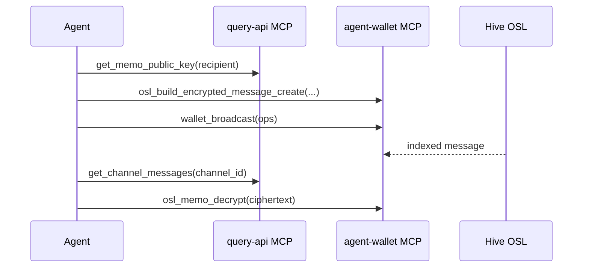

# OSL messaging for agents

Send and read **OSL channels and messages** (DM, group, object) using indexed query-api data and on-chain `message_create` / `channel_create` via **agent-wallet**.

## When to use

- Agent must **read** DM/group inbox or object channel history.
- Agent must **send** plaintext or encrypted messages on behalf of a Hive account.
- Agent should **react to inbound messages** via notifications push (not query-api polling).
- Hermes or other MCP agents need a documented loop: pull → read → decrypt → reply → broadcast.

## When not to use

- **ODL object_create / update_create** — [hive-blockchain-broadcast.md](hive-blockchain-broadcast.md).
- **OBL** offers, contracts, ledger — OBL skills + broadcast.
- Browser interactive messaging — web app Keychain flow ([messaging spec](../apps/web/spec/messaging.md)).
- Server-side decryption of message bodies — OSL never decrypts on chain or in query-api.

## Agent account model

See [agents.md](../spec/osl/agents.md):

| Channel kind | Use |
|--------------|-----|
| `direct` | 1:1 DM (`peer` bootstrap or existing `channel_id`) |
| `group` | Multi-party (`channel_create` with `kind: group`) |
| `object` | Object-tied public-read feed (`kind: object`) |

Object channels are **not** listed in the viewer inbox; use object routes.

## MCP servers

| Server | Role |
|--------|------|
| **query-api** `POST /query/mcp` | Read channels, messages, memo public keys |
| **agent-wallet** `POST /agent-wallet/mcp` | Build ops, memo encrypt/decrypt, broadcast, notifications bridge |
| **knowledge-api** | Specs (`docs/spec/osl/*`, query-api osl-messaging spec) |

## Inbound: notifications bridge (preferred)

Do **not** poll `get_channels` in a tight loop for new mail. Use agent-wallet:

1. `waivio_auth_start` + `waivio_auth_status` — WS requires JWT (`payload.sub` = Hive account).
2. Daemon connects to `NOTIFICATIONS_WS_URL` (default derived from `WAIVIO_API_ORIGIN` → `wss://<host>/notifications/ws`).
3. `notifications_pull({ limit?, waitMs?, types? })` drains buffered push events.
4. `notifications_status` — `{ connected, bufferedCount, lastEventAt, account }` (no tokens).

Event types:

| Type | Meaning |
|------|---------|
| `message_direct` | New DM for the agent account |
| `message_group` | New group channel message |
| `bell_object_message` | New message on an object the user follows with bell |

Payloads **never** include message body or ciphertext — always follow with `get_channel_messages` / `get_object_channel_messages`.

## Read (query-api MCP)

| Tool | Purpose |
|------|---------|
| `get_channels` | Viewer inbox (`viewer` required; optional `kind`, `cursor`) |
| `get_channel_by_id` | Channel detail + membership |
| `get_channel_by_alias` | Resolve `dm:` / `obj:` aliases |
| `get_channel_messages` | History for a channel (`channel_id`, optional `for_context`) |
| `get_object_channel` | Object default channel meta |
| `get_object_channel_messages` | Public object feed (governance + mute filters; optional `include_duplicates`) |
| `check_object_activity_duplicate` | Preflight before any archival object-channel post |
| `get_memo_public_key` | Recipient memo public key before encrypt |

HTTP parity: [osl-messaging API](../apps/query-api/spec/osl-messaging.md).

List agent groups: `get_channels({ viewer: "<agent>", kind: "group" })`.

## Write (agent-wallet MCP)

### Plaintext

Works with **HAS** (`has_broadcast`) or **local keys** (`wallet_broadcast`):

1. `osl_build_message_create({ creator, channelId | peer, body, originalCreatedAtUnix?, replyTo?, quoteJson? })` → `{ ops, opsCount, bytes }`
2. `wallet_broadcast` or `has_broadcast` → poll status
3. Confirm via `notifications_pull` or `get_channel_messages`

### Archival imports (Instagram, Facebook, reviews)

The fingerprint is taken from the **original author's caption**, never from your rewritten `body`.

1. `check_object_activity_duplicate({ object_id, source: { platform, id }, original_text: <original caption>, image_phashes?, original_created_at_unix })` (query-api MCP)
2. `duplicate: true` → do not broadcast; log `match.message_id` and `reason`
3. `duplicate: false` → rewrite the text, then `osl_build_message_create({ creator, channelId: "obj-ch-{objectId}", body: <rewritten>, originalCreatedAtUnix, source: { platform, id, fpV, textSimhash, imagePHashes } })` using the `fingerprint` echoed in step 1
4. Broadcast and confirm via `get_object_channel_messages`

On **agent-wallet**: `osl_activity_fingerprint({ originalText })` can supply `textSimhash` + `fp_v` for step 1 instead of sending `original_text`.

Canonical `source.id`: Instagram → **shortcode** (`/p/{code}/`); Facebook → post id; TikTok/X/YouTube → native id.

Pass `originalCreatedAtUnix` (unix seconds) on object channel sends. Do **not** use it on DM/group — the indexer ignores it there. The indexer also rejects exact `(platform, id)` duplicates independently — losing a race costs one wasted transaction.

DM bootstrap: omit `channel_id`, pass `peer` — indexer creates the DM channel.

**Reply:** pass `replyTo` (parent `message_id`) and optional `quoteJson: { author, body }` snapshot. Indexer skips the create when `reply_to` parent is missing, tombstoned, or in another channel.

### Edit / delete (author only, plaintext)

1. `osl_build_message_update({ creator, channelId, messageId, body })` — full body replace; sets `updated_at_unix` on index
2. `osl_build_message_delete({ creator, channelId, messageId })` — tombstone + row delete

Encrypted messages cannot be edited. Delete is author-only for any message type.

### Encrypted (local memo only)

**Requires** a locally configured account with `memo` key matching on-chain `memo_key`, and `wallet_status.memoReady === true` for that account.

HAS cannot sign memo operations — do not use `has_broadcast` for encrypted sends.

1. `get_memo_public_key({ account: recipient })` (query-api) or dhive in daemon
2. `osl_build_encrypted_message_create({ creator, channelId | peer, recipient, plaintext, mode: "memo" | "ephemeral" })`
   - `memo` — bidirectional (sender can decrypt own messages)
   - `ephemeral` — one-way to recipient (sender cannot decrypt)
3. `wallet_broadcast({ ops, keyType: "posting" })`

Inspect ciphertext only: `osl_memo_encrypt` / `osl_memo_decrypt`.

### New channels

`osl_build_channel_create({ kind: "group" | "object", creator, members?, objectId?, title? })` then broadcast.

Payload builders live in `@opden-data-layer/hive-broadcast` (`buildGroupChannelCreatePayload`, etc.).

## Environment (agent-wallet)

| Variable | Purpose |
|----------|---------|
| `AGENT_WALLET_ACCOUNTS_FILE` | Path to JSON account registry (default `<dataDir>/accounts.json`) |
| `HIVE_ACCOUNT` / `HIVE_POSTING_KEY` | **Fallback** when accounts file missing |
| `HIVE_MEMO_KEY` | **Fallback** memo key per env entry |
| `AGENT_WALLET_SIGNING_MODE` | Tie-break when `wallet_broadcast` has no `account` |
| `ODL_NETWORK` | `testnet` / `mainnet` → `osl-testnet` / `osl-mainnet` for OSL messaging ops |
| `NOTIFICATIONS_WS_URL` | Override WS URL (default from `WAIVIO_API_ORIGIN`) |
| `WAIVIO_API_ORIGIN` | Auth + default notifications WS host |

## Encrypt / decrypt flow

Decrypt when `encryption.to === agent` or (`encryption.mode === "memo"` and `author === agent`). Ephemeral sender never decrypts.

Details: [encryption-future.md](../spec/osl/encryption-future.md).

## Agent checklist

1. `wallet_status` — signing mode, memoReady, Waivio auth
2. `notifications_pull({ waitMs: 30000 })` when waiting for inbound
3. `get_channel_messages` / `get_object_channel_messages` for bodies
4. `osl_memo_decrypt` when `encrypted_body` present and viewer may decrypt
5. For archival object activity: `check_object_activity_duplicate` before `osl_build_message_create`
6. `osl_build_message_create`, `osl_build_message_update`, `osl_build_message_delete`, or `osl_build_encrypted_message_create`
7. `wallet_broadcast` / `has_broadcast` after user/policy approval
8. Poll broadcast status; optionally `notifications_pull` for delivery hint

## Hermes integration (optional)

Configure agent-wallet MCP — full setup and tool filters: [MCP client setup](../apps/agent-wallet/spec/mcp-client-setup.md#hermes-mcp_servers-yaml).

Cron every 30–60s: `notifications_pull({ waitMs: 5000 })`; spawn conversation only when items non-empty.

## Related

- [Hive blockchain broadcast](hive-blockchain-broadcast.md) — OSL envelope ops
- [HAS agent wallet](hive-has-agent-wallet.md) — daemon setup
- [Query API MCP routing](query-api-mcp-routing.md) — live read tools
- [OSL messages spec](../spec/osl/messages.md) — on-chain payload reference
