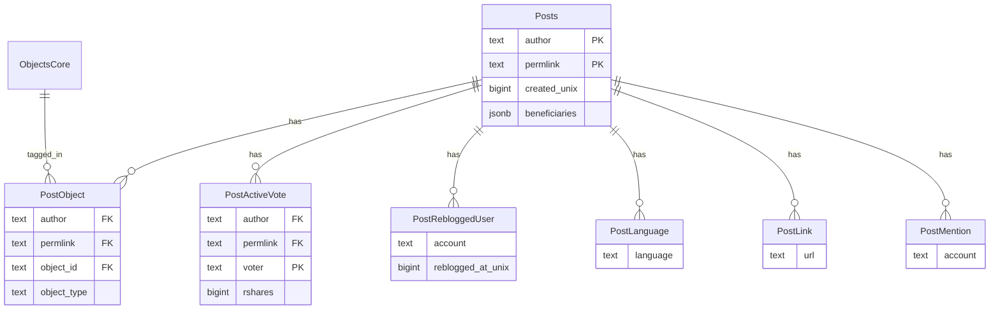

# PostgreSQL: Hive posts (legacy Mongo normalization)

Normative DDL lives in [schema.sql](schema.sql). Kysely row types: `@opden-data-layer/core` (`OdlDatabase`, `PostsTable`, etc.).

This schema normalizes the legacy Mongo `PostSchema` (embedded arrays and denormalized fields) into relational tables. **Not migrated:** `blocked_for_apps`, singular `language`, `reblog_to` (reblogs modeled via `post_reblogged_users` + join to `posts`).

## Roles of the tables

| Table | Role |
| ----- | ---- |
| **posts** | One row per Hive post. Primary key `(author, permlink)`. Scalar fields + `beneficiaries` as JSONB + `created_unix` for sorting. |
| **post_active_votes** | One row per active vote on a post. FK to `posts`. |
| **post_objects** | Many-to-many: post ↔ `objects_core`. `object_type` denormalized for filters without JOIN. |
| **post_reblogged_users** | Who reblogged which post; `reblogged_at_unix` drives chronological “reblog in my feed” ordering. |
| **post_languages** | BCP 47 tags per post (multi-value); filter news streams by language. |
| **post_links** | URLs extracted for indexed lookup. |
| **post_mentions** | Hive account names mentioned in the post for indexed lookup. |
| **user_post_drafts** | Optional editor drafts per Hive account (`author`, `draft_id`). Optional `permlink` links one draft to a chain post; unique per `(author, permlink)` when set. See [user-post-drafts-endpoint.md](../../apps/query-api/spec/user-post-drafts-endpoint.md). |

## Entity relationship



## Indexes (summary)

| Table | Index | Purpose |
| ----- | ----- | ------- |
| posts | `(author, created_unix DESC)` | Author timeline by time |
| post_active_votes | `(voter)` | Look up votes by voter |
| post_objects | `(object_id)` | Posts for an object |
| post_objects | `(object_type)` partial | Filter by type |
| post_reblogged_users | `(account, reblogged_at_unix DESC)` | User feed including reblogs |
| post_languages | `(language)` | Language-filtered streams |
| post_links | `(url)` | Reverse lookup by URL |
| post_mentions | `(account)` | Posts mentioning an account |

## User feed: posts + reblogs (newest first)

**Implementation note:** Use a **pushdown `UNION ALL`** so each branch applies the **keyset cursor** and `LIMIT` under its own index (`posts(author, created_unix DESC)` and `post_reblogged_users(account, reblogged_at_unix DESC)`), then merge at most `2 × (limit + 1)` rows in the outer query. A naive single `UNION ALL` sorted globally materializes large intermediate sets.

Only **root posts** are included in the “blog” branch: **`depth` is null or 0**, or **`TRIM(COALESCE(parent_* , '')) = ''`** for both parents (Hive convention). Different importers populate one or the other; the query **OR**s these so feeds are not empty when only one signal is present. Reblogs join `post_reblogged_users` to `posts` with the same root filter on `p`.

**Cursor:** Composite keyset `(feed_at, author, permlink)` — encode/decode in the application layer (opaque to clients). **Dedup:** If a user reblogs their own post, the same `(author, permlink)` can appear in both branches; keep the first row after merge (higher `feed_at`).

Example shape (pseudocode; omit the `WHERE` tuple on the first page):

```sql
(
  SELECT author, permlink, created_unix AS feed_at, NULL::text AS reblogged_by
  FROM posts
  WHERE author = $account
    AND (
      depth IS NULL OR depth = 0
      OR (TRIM(COALESCE(parent_author, '')) = '' AND TRIM(COALESCE(parent_permlink, '')) = '')
    )
    AND (created_unix, author, permlink) < ($cursor_feed_at, $cursor_author, $cursor_permlink)
  ORDER BY created_unix DESC, author DESC, permlink DESC
  LIMIT $limit + 1
)
UNION ALL
(
  SELECT p.author, p.permlink, r.reblogged_at_unix AS feed_at, r.account AS reblogged_by
  FROM post_reblogged_users r
  JOIN posts p USING (author, permlink)
  WHERE r.account = $account
    AND (r.reblogged_at_unix, p.author, p.permlink) < ($cursor_feed_at, $cursor_author, $cursor_permlink)
  ORDER BY r.reblogged_at_unix DESC, p.author DESC, p.permlink DESC
  LIMIT $limit + 1
)
ORDER BY feed_at DESC, author DESC, permlink DESC
LIMIT $limit + 1;
```

## Related

- [flow.md](flow.md) — core object/update/vote flows (separate concern from Hive posts)
- [social-account-ingestion.md](../social-account-ingestion.md) — account ingestion context
