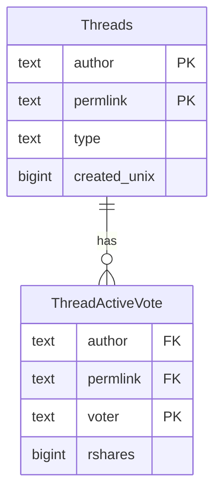

# PostgreSQL: Hive threads (Leo / Ecency)

Normative DDL lives in [schema.sql](schema.sql). Kysely row types: `@opden-data-layer/core` (`ThreadsTable`, `ThreadActiveVotesTable`).

## Roles

| Table | Role |
| ----- | ---- |
| **threads** | One row per thread-style comment (reply to `leothreads` or `ecency.waves`). PK `(author, permlink)`. Derived arrays (`hashtags`, `mentions`, `links`, …) + `created_unix` for sorting. |
| **thread_active_votes** | One row per active vote on a thread row. FK to `threads`. |

## Entity relationship

## Indexes

| Table | Index | Purpose |
| ----- | ----- | ------- |
| threads | `(created_unix DESC)` | Chronological listing |
| thread_active_votes | `(voter)` | Look up votes by voter |
