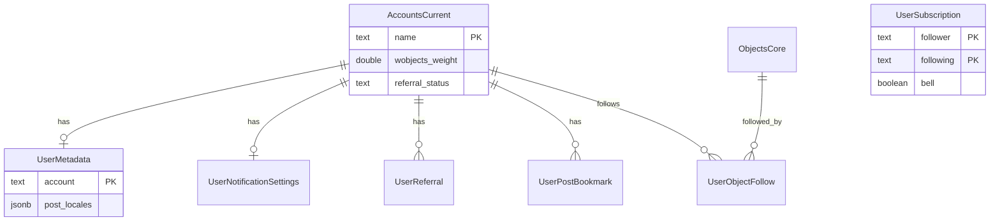

# PostgreSQL: Waivio users (legacy Mongo normalization)

Normative DDL lives in [schema.sql](schema.sql). Kysely row types: `@opden-data-layer/core` (`OdlDatabase`, `AccountsCurrentTable`, `UserMetadataTable`, etc.).

Constants: `REFERRAL_TYPES`, `REFERRAL_STATUSES`, `SUPPORTED_CURRENCIES` in `@opden-data-layer/core` (`constants/user.constants.ts`).

## Roles of the tables

| Table | Role |
| ----- | ---- |
| **accounts_current** | Hive account row + Waivio fields (`alias`, `profile_image`, `wobjects_weight`, counts, `stage_version`, `referral_status`, `last_activity`). |
| **user_metadata** | 1:1 settings from `UserMetadataSchema` (excluding nested `userNotifications`). |
| **user_notification_settings** | 1:1 notification toggles from `UserNotificationsSchema` (nested under `user_metadata.settings` in Mongo). Column `vote` stores Mongo `like` (`like` is reserved in SQL). |
| **user_referrals** | Rows from `referral[]`; PK `(account, agent, type)`. |
| **user_post_bookmarks** | Bookmark strings that look like `author/permlink` (post refs). Object-only strings (no `/`) are not stored. |
| **user_subscriptions** | `SubscriptionSchema` follower/following + `bell`. |
| **user_account_mutes** | Hive social ignore pairs (`muter`, `muted`); PK `(muter, muted)`. |
| **user_object_follows** | `objects_follow[]` with `object_id` in `objects_core`; `bell` default false (Mongo had no per-field bell). |

## Entity relationship

## Indexes (summary)

| Table | Index | Purpose |
| ----- | ----- | ------- |
| user_referrals | `(agent)` | Lookup by agent |
| user_post_bookmarks | `(account)` | List bookmarks per user |
| user_subscriptions | `(following)` | Followers of an account |
| user_object_follows | `(object_id)` | Who follows an object |

## Data import

Mongo → Postgres scripts: [`scripts/migrate-mongo-to-pg/README.md`](../../../scripts/migrate-mongo-to-pg/README.md) (`pnpm migrate:mongo-users`, `pnpm migrate:mongo-subscriptions`, `pnpm migrate:mongo-mutes`).

## Related

- [flow.md](flow.md) — core object/update/vote flows
- [social-account-ingestion.md](../social-account-ingestion.md) — Hive `accounts_current` context
