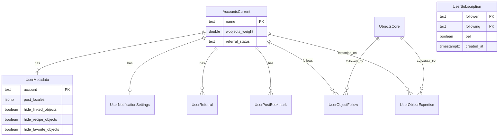

# PostgreSQL: Waivio users (legacy Mongo normalization)

Normative DDL lives in [schema.sql](schema.sql). Kysely row types: `@opden-data-layer/odl-db-types` (`OdlDatabase`, `AccountsCurrentTable`, `UserMetadataTable`, etc.).

Constants: `REFERRAL_TYPES`, `REFERRAL_STATUSES`, `SUPPORTED_CURRENCIES` in `@opden-data-layer/core` (`constants/user.constants.ts`).

## Roles of the tables

| Table | Role |
| ----- | ---- |
| **accounts_current** | Hive account row + Waivio fields (`alias`, `profile_image`, `wobjects_weight`, counts, `stage_version`, `referral_status`, `last_activity`). |
| **user_metadata** | 1:1 settings from `UserMetadataSchema` (excluding nested `userNotifications`). Includes shop/favorites visibility: `hide_linked_objects`, `hide_recipe_objects`, `hide_favorite_objects`. |
| **user_notification_settings** | 1:1 notification toggles from `UserNotificationsSchema` (nested under `user_metadata.settings` in Mongo). Column `vote` stores Mongo `like` (`like` is reserved in SQL). Columns `claimed_object_updates`, `group_id_control`, `followed_user_threads` gate object/thread notifications (migration `00050`). `messages` gates DM/group notifications (`00056`). `obl` gates Open Business Layer lifecycle notifications (`00063`). Legacy `deactivation_campaign` remains in DB but is not exposed in the web UI. Dropped columns: `activation_campaign`, `status_change`. |
| **user_shop_deselect** | Per-user deselect of post-linked objects from shop/favorites (`account`, `object_id`). |
| **user_referrals** | Rows from `referral[]`; PK `(account, agent, type)`. |
| **user_post_bookmarks** | Bookmark strings that look like `author/permlink` (post refs). Object-only strings (no `/`) are not stored. |
| **user_subscriptions** | `SubscriptionSchema` follower/following + `bell` + `created_at` (relationship time; default `NOW()`, backfilled from Mongo `_id` where available). |
| **user_account_mutes** | Hive social ignore pairs (`muter`, `muted`); PK `(muter, muted)`. |
| **user_account_auths** | Hive `account_auths` snapshot (`grantor`, `authority_type`, `grantee`); reverse lookup for delegated authority. |
| **user_account_auth_sync** | Backfill checkpoint for authority sync per account. |
| **user_object_follows** | `objects_follow[]` with `object_id` in `objects_core`; `bell` default false (Mongo had no per-field bell). `created_at` defaults `NOW()`; migrated rows use user document `_id` time as an approximation. |
| **user_object_expertise** | Per-user per-object post-author expertise (`user_name` + `author_permlink` + `weight` from legacy `user_expertise`). Aggregate `accounts_current.wobjects_weight` remains denormalized. |

## Entity relationship

```mermaid
erDiagram
  AccountsCurrent ||--o| UserMetadata : "has"
  AccountsCurrent ||--o| UserNotificationSettings : "has"
  AccountsCurrent ||--o{ UserReferral : "has"
  AccountsCurrent ||--o{ UserPostBookmark : "has"
  AccountsCurrent ||--o{ UserObjectFollow : "follows"
  AccountsCurrent ||--o{ UserObjectExpertise : "expertise_on"
  ObjectsCore ||--o{ UserObjectFollow : "followed_by"
  ObjectsCore ||--o{ UserObjectExpertise : "expertise_for"

  AccountsCurrent {
    text name PK
    double wobjects_weight
    text referral_status
  }

  UserMetadata {
    text account PK
    jsonb post_locales
    boolean hide_linked_objects
    boolean hide_recipe_objects
    boolean hide_favorite_objects
  }

  UserSubscription {
    text follower PK
    text following PK
    boolean bell
    timestamptz created_at
  }
```

## Indexes (summary)

| Table | Index | Purpose |
| ----- | ----- | ------- |
| user_referrals | `(agent)` | Lookup by agent |
| user_post_bookmarks | `(account)` | List bookmarks per user |
| user_shop_deselect | `(account)` | List deselected post-linked objects per user |
| user_subscriptions | `(following)`, `(following, created_at DESC)`, `(follower, created_at DESC)` | Followers of an account; recency listings |
| user_object_follows | `(object_id)`, `(account, created_at DESC)` | Who follows an object |
| user_object_expertise | `(account, weight DESC)`, `(object_id)` | Profile expertise lists |
| user_account_auths | `(grantee, authority_type, grantor)` | Reverse lookup: who granted authority to a grantee |
| user_account_auth_sync | `(account)` PK | Backfill / sync checkpoint per account |
| post_objects | `(author)` | Shop/favorites: filter post-linked objects by profile author |

## Data import

Mongo → Postgres scripts: [`scripts/migrate-mongo-to-pg/README.md`](../../../scripts/migrate-mongo-to-pg/README.md) (`pnpm migrate:mongo-users`, `pnpm migrate:mongo-subscriptions`, `pnpm migrate:mongo-mutes`).

## Related

- [flow.md](flow.md) — core object/update/vote flows
- [social-account-ingestion.md](../social-account-ingestion.md) — Hive `accounts_current` context
