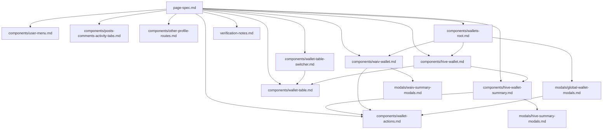

# User profile page — implementation-independent UI specification

## Purpose

Describes the `/@:username` profile area: persistent chrome, dynamic content region, nested routes, and global states. Cross-file links use **relative paths** from this file (clickable Markdown links to sibling `components/`, `modals/`, and files in this folder).

---

## Spec graph (navigation)



---

## Layout structure (persistent vs dynamic)

| Region | Role | Spec reference |
|--------|------|----------------|
| Document shell + Helmet | Meta, favicon, title | This file (page shell) |
| **Profile header** (avatar, identity, follow/mute, vote value) | Persistent chrome | *Not extracted to a separate spec file* — behavior summarized here and in source `UserHeader` |
| **Top horizontal nav** | Primary route switcher | [components/user-menu.md](components/user-menu.md) |
| **Left sidebar** | Context widgets | *Implementation: LeftSidebar* — not a separate spec file |
| **Right sidebar** | Context widgets | *Implementation: RightSidebar* — not a separate spec file |
| **Center column** | Nested route body — **only region** for child loading/empty/infinite scroll | Per-route: see **Visible UI blocks** and **Nested child routes** |

When `globalTableMode` is true, left/right sidebars are **not** rendered; center uses full-width table layout (see below).

---

## Visible UI blocks — `extracted_to` map

Every extracted block below lists its spec file path.

| Visible block | extracted_to |
|---------------|--------------|
| Top menu (Posts, Map, Shop, …, Wallet, …) | [components/user-menu.md](components/user-menu.md) |
| Posts / threads / comments / mentions / activity tabs | [components/posts-comments-activity-tabs.md](components/posts-comments-activity-tabs.md) |
| Followers, following, following-objects, favorites, shop/recipe, map, reblogs, expertise, about (aggregate) | [components/other-profile-routes.md](components/other-profile-routes.md) |
| Wallet entry: WAIV/HIVE/ENGINE/Rebalancing tabs + global modal host | [components/wallets-root.md](components/wallets-root.md) |
| HIVE wallet tab: summary + history + advanced reports entry | [components/hive-wallet.md](components/hive-wallet.md) |
| HIVE summary: token rows, RC, savings, delegations | [components/hive-wallet-summary.md](components/hive-wallet-summary.md) |
| Reusable wallet primary + dropdown actions | [components/wallet-actions.md](components/wallet-actions.md) |
| WAIV wallet tab: summary + list + rewards toggle | [components/waiv-wallet.md](components/waiv-wallet.md) |
| Advanced reports spreadsheet (HIVE/WAIV/details) | [components/wallet-table.md](components/wallet-table.md) |
| WAIV advanced reports: Standard vs Generated tabs | [components/wallet-table-switcher.md](components/wallet-table-switcher.md) |
| Globally mounted wallet modals (transfer, power, swap, …) | [modals/global-wallet-modals.md](modals/global-wallet-modals.md) |
| HIVE summary local modals (delegation lists, savings progress, …) | [modals/hive-summary-modals.md](modals/hive-summary-modals.md) |
| WAIV summary local modals (delegate list, power-down) | [modals/waiv-summary-modals.md](modals/waiv-summary-modals.md) |
| Verification / grep inventory | [verification-notes.md](verification-notes.md) |

**Shared component** (no single parent): [components/wallet-actions.md](components/wallet-actions.md) — used inside multiple summary blocks; see that file.

---

## integration_contract (page shell)

```yaml
integration_contract:
  input_data:
    - route_param_name: profile username
    - route_segment: sub-area key
    - query_wallet_type: WAIV | HIVE | ENGINE | rebalancing
    - viewer_session: authenticated user or anonymous
  emitted_actions:
    - navigation_to_child_route
    - open_wallet_modal_via_redux  # from children
  controlled_by_page_state:
    - profile_user_loading
    - global_table_mode  # isOpenWalletTable
    - route_match_nested_routes
```

---

## Route scope (parent)

The profile is a single parent route with `pathScope: '/@:name'` and nested `routes`. Primary config: `src/routes/configs/routes.js` (User route group).

Path param **`name`**: profile username.  
Path segment **`0`** (first unnamed segment): sub-area key (e.g. `transfers`, `followers`, `about`, `posts` implied as default).

## Page-level view model

| Field | Description |
|--------|-------------|
| `profileUser` | Displayed user: identity, stats, metadata, muted state, loading flags. |
| `viewer` | Authenticated account or anonymous; determines own-profile actions. |
| `routeSegment` | Value of `match.params['0']` or derived default (`posts` for base `/@name`). |
| `walletQueryType` | On wallet: `?type=` → `WAIV`, `HIVE`, `ENGINE`, `rebalancing`. |
| `globalTableMode` | Boolean: advanced reports table is open (hides sidebars, special center layout). |
| `appFlavor` | Whether Waivio/Social features (shop, map, recipes, favorites tabs) appear in top menu. |

## Static layout vs dynamic region

### Persistent (not tied to child route body loading)

- **Document shell**: `main-panel` root; React Helmet title/description/canonical/social meta; favicon.
- **User hero** (below Helmet):
  - **Profile header**: avatar (lightbox), display name, weight tag, follow/mute/bell/edit controls, vote value, rank, about snippet, location/website/activity on mobile layout.  
    - *extracted_to: N/A (see Layout structure table)*
  - **Horizontal primary nav**: extracted_to: [components/user-menu.md](components/user-menu.md)
- **Side columns** (desktop): **Left** and **Right** sidebars in Affix containers (`stickPosition: 72`), **unless** global table mode is active (see below). *Not extracted to separate spec files.*

### Dynamic region (child route only)

- **Center column**: Nested route component (`renderRoutes`). This is the only region that should show **child-level** loading spinners, empty states, and infinite-scroll loaders. Maps to **Visible UI blocks** / nested route table below.
- **Initial profile fetch**: While the profile user is fetching, a **centered loading indicator** can occupy the main area **above** the hero + three-column layout; hero and sidebars appear after user payload resolves.

### Global “advanced reports” mode (`globalTableMode`)

- **Source**: Redux flag `isOpenWalletTable` (set when entering wallet table views; cleared on leave).
- **Effects**:
  - Left and right **sidebars are not rendered**.
  - Center column uses class `display-table` (full-width table presentation).
  - App-level chrome (e.g. scroll-to-top / modal backdrop styling) may switch to a brighter variant — **not** a full page reload.

### About route

- Center content uses padding class `pa3`.
- **Left sidebar hidden** (CSS `display-none` on left column).

## Top-level navigation matrix (`UserMenu`)

| Order | Label (default EN) | Target (pattern) | Active when `routeSegment` |
|-------|-------------------|------------------|------------------------------|
| 1 | Posts | `/@name` | `discussions`, `comments`, `activity`, `posts`, `threads`, `mentions` (posts aggregate) |
| 2 | Map | `/@name/map` | `map` (if Waivio/Social) |
| 3 | Shop | `/@name/userShop` | `userShop` (if Waivio/Social) |
| 4 | Recipes | `/@name/recipe` | `recipe` (if Waivio/Social) |
| 5 | Favorites | `/@name/favorites` | `favorites` (if Waivio/Social) |
| 6 | Wallet | `/@name/transfers?type=WAIV` | `transfers` |
| 7 | Followers (count) | `/@name/followers` | `followers`, `following`, `following-objects` |
| 8 | Expertise | `/@name/expertise-hashtags` | `expertise-hashtags`, `expertise-objects` |
| 9 | About | `/@name/about` | `about` |

**Interaction**: All items are **navigation** (URL change). No purely local tab state without route update.  
**extracted_to:** [components/user-menu.md](components/user-menu.md)

## Nested child routes (summary)

| Path segment(s) | Component (concept) | extracted_to |
|-----------------|---------------------|--------------|
| `''` or posts variants | Posts / threads / comments / mentions / activity | [components/posts-comments-activity-tabs.md](components/posts-comments-activity-tabs.md) |
| `followers` / `following` / `following-objects` | Followers lists | [components/other-profile-routes.md](components/other-profile-routes.md) |
| `userShop` / `recipe` + optional department | Shop or recipe catalog | [components/other-profile-routes.md](components/other-profile-routes.md) |
| `favorites` + optional object type | Favorites grid | [components/other-profile-routes.md](components/other-profile-routes.md) |
| `map` | User map | [components/other-profile-routes.md](components/other-profile-routes.md) |
| `reblogs` | Reblog feed | [components/other-profile-routes.md](components/other-profile-routes.md) |
| `transfers` + query | Wallet root | [components/wallets-root.md](components/wallets-root.md) |
| `transfers/table` | HIVE advanced table | [components/wallet-table.md](components/wallet-table.md) |
| `transfers/waiv-table` | WAIV advanced table + generator tab | [components/wallet-table-switcher.md](components/wallet-table-switcher.md) |
| `transfers/details/:reportId` | Saved report table | [components/wallet-table.md](components/wallet-table.md) |
| `expertise-hashtags` / `expertise-objects` | Expertise lists | [components/other-profile-routes.md](components/other-profile-routes.md) |
| `about` | About | [components/other-profile-routes.md](components/other-profile-routes.md) |

## State transitions (high level)

1. **Profile load**: Fetching → user present → hero + sidebars + child route mount.
2. **Top nav click**: URL change → new `routeSegment` → new child component; **no full reload** (SPA).
3. **Enter wallet table**: `globalTableMode` on → sidebars hide; back link returns to wallet or generated reports per table variant.
4. **Mute**: If profile is muted for viewer, posts area shows empty muted state instead of feeds.

## SEO / identity

- Title pattern: `{displayName} {tab-specific suffix}` (e.g. wallet → “wallet”).
- Canonical URL includes query string where used in implementation.

## Uncertain / implementation quirks

- **`User.js` passes `onTransferClick`, `rewardFund`, `rate` to `UserHero`, but `UserHero` does not forward them** — no transfer trigger from hero in current wiring (possible dead props).
- **`UserExpertise` references `UserExpertise.limit` in JSX while module defines `limit = 30` at top level** — `UserExpertise.limit` may be undefined at runtime; effective behavior should be verified in browser.

## Related files (source)

- Shell: `src/client/user/User.js`, `UserHero.js`
- Nav: `src/client/components/UserMenu.js`
- Tables flag: `src/store/walletStore/walletReducer.js`, `walletSelectors.js`

## References

- [components/user-menu.md](components/user-menu.md) — top nav extracted spec
- [components/posts-comments-activity-tabs.md](components/posts-comments-activity-tabs.md) — default content tabs
- [components/other-profile-routes.md](components/other-profile-routes.md) — non-wallet child routes aggregate
- [components/wallets-root.md](components/wallets-root.md) — wallet tab system host
- [components/hive-wallet.md](components/hive-wallet.md) — HIVE wallet route body
- [components/hive-wallet-summary.md](components/hive-wallet-summary.md) — HIVE token rows and summary
- [components/wallet-actions.md](components/wallet-actions.md) — shared action control (referenced by summaries)
- [components/waiv-wallet.md](components/waiv-wallet.md) — WAIV wallet route body
- [components/wallet-table.md](components/wallet-table.md) — advanced reports grid
- [components/wallet-table-switcher.md](components/wallet-table-switcher.md) — WAIV table tab shell
- [modals/global-wallet-modals.md](modals/global-wallet-modals.md) — modals mounted at wallet root
- [modals/hive-summary-modals.md](modals/hive-summary-modals.md) — HIVE summary dialogs
- [modals/waiv-summary-modals.md](modals/waiv-summary-modals.md) — WAIV summary dialogs
- [verification-notes.md](verification-notes.md) — cross-check and navigation inventory
