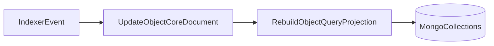
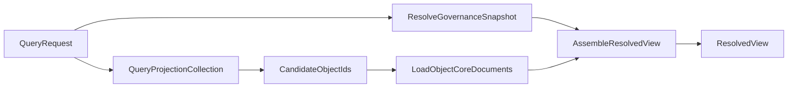

# Core, Projection, and Resolved View Flow

This document describes how the minimal core object model and the query projection model work together, and how the query API should produce a final `ResolvedView`.

Related files:

- `mongo-concept/objects-denormalization-mongo-enhanced.ts`
- `mongo-concept/objects-query-projection-mongo.ts`

## Roles of the three layers

### 1. Core object document

The core document is the authoritative stored truth for one object.

It contains:

- object identity (`objectId`, `objectType`, `creator`)
- object metadata (`weight`, `metaGroupId`)
- active updates
- raw validity votes
- raw rank votes for multi-value updates

It does not contain:

- governance-derived final status
- decisive role
- final ranking order
- query-only helper/index structures

### 2. Query projection document

The projection document is a derived query helper.

It exists to make Mongo queries practical and indexable.

It contains:

- flattened queryable values
- direct pointers back to source updates
- optional helper arrays for text, geo, and exact-match lookups

It does not contain:

- authoritative final validity
- governance decisions
- final multi-value ranking

### 3. Resolved view

The resolved view is the final query API response.

It is computed at request time using:

- the core object document
- the resolved governance snapshot
- vote semantics
- ranking semantics

## Write flow

Write flow happens on the index server.



## Step 1: Write to core

When an event arrives, the index server updates the `ObjectCoreDocument`.

Examples:

- `update_create`
  - add/update active update in `updates`
- `update_vote`
  - mutate `validityVotes` for the target update
- `rank_vote`
  - mutate `rankVotes` for the target multi-value update

Important:

- only raw active vote state is stored
- no final governance-dependent interpretation is stored

## Step 2: Build the projection

After the core document is updated, build or rebuild the query projection document for that object.

Projection builder logic:

1. read the active updates from the core object
2. keep only queryable facts
3. flatten them into `queryFields`
4. add helper arrays like `searchText`, `geoPoints`, `exactValueKeys`
5. store `sourceUpdateId` so the query layer can go back to the core update later

## Example core document

```json
{
  "objectId": "place:central-park",
  "objectType": "place",
  "creator": "alice",
  "weight": 152.4,
  "metaGroupId": "nyc-parks",
  "updates": [
    {
      "updateId": "upd-name-alice-1",
      "updateType": "name",
      "creator": "alice",
      "cardinality": "single",
      "createdAtUnix": 1710000000,
      "createdPosition": {
        "blockNum": 100,
        "trxIndex": 0,
        "opIndex": 0,
        "transactionId": "tx-100-0-0"
      },
      "value": {
        "valueKind": "text",
        "valueText": "Central Park"
      },
      "validityVotes": []
    },
    {
      "updateId": "upd-map-alice-1",
      "updateType": "map",
      "creator": "alice",
      "cardinality": "single",
      "createdAtUnix": 1710000010,
      "createdPosition": {
        "blockNum": 100,
        "trxIndex": 0,
        "opIndex": 1,
        "transactionId": "tx-100-0-1"
      },
      "value": {
        "valueKind": "geo",
        "valueGeo": {
          "type": "Point",
          "coordinates": [-73.9654, 40.7829]
        }
      },
      "validityVotes": []
    },
    {
      "updateId": "upd-tag-bob-1",
      "updateType": "tags",
      "creator": "bob",
      "cardinality": "multi",
      "createdAtUnix": 1710000100,
      "createdPosition": {
        "blockNum": 101,
        "trxIndex": 1,
        "opIndex": 0,
        "transactionId": "tx-101-1-0"
      },
      "value": {
        "valueKind": "text",
        "valueText": "park"
      },
      "validityVotes": [
        {
          "voter": "admin-1",
          "vote": "against",
          "position": {
            "blockNum": 105,
            "trxIndex": 0,
            "opIndex": 0,
            "transactionId": "tx-105-0-0"
          }
        }
      ],
      "rankVotes": [
        {
          "voter": "owner-1",
          "rank": 9000,
          "rankContext": "default",
          "position": {
            "blockNum": 106,
            "trxIndex": 0,
            "opIndex": 0,
            "transactionId": "tx-106-0-0"
          }
        }
      ]
    },
    {
      "updateId": "upd-tag-carol-1",
      "updateType": "tags",
      "creator": "carol",
      "cardinality": "multi",
      "createdAtUnix": 1710000200,
      "createdPosition": {
        "blockNum": 102,
        "trxIndex": 0,
        "opIndex": 0,
        "transactionId": "tx-102-0-0"
      },
      "value": {
        "valueKind": "text",
        "valueText": "nature"
      },
      "validityVotes": [],
      "rankVotes": [
        {
          "voter": "owner-1",
          "rank": 8500,
          "rankContext": "default",
          "position": {
            "blockNum": 106,
            "trxIndex": 0,
            "opIndex": 1,
            "transactionId": "tx-106-0-1"
          }
        }
      ]
    }
  ]
}
```

## Example query projection document

```json
{
  "objectId": "place:central-park",
  "objectType": "place",
  "creator": "alice",
  "weight": 152.4,
  "metaGroupId": "nyc-parks",
  "queryFields": [
    {
      "sourceUpdateId": "upd-name-alice-1",
      "updateType": "name",
      "creator": "alice",
      "cardinality": "single",
      "valueKind": "text",
      "valueText": "Central Park",
      "exactValueKey": "central park"
    },
    {
      "sourceUpdateId": "upd-map-alice-1",
      "updateType": "map",
      "creator": "alice",
      "cardinality": "single",
      "valueKind": "geo",
      "valueGeo": {
        "type": "Point",
        "coordinates": [-73.9654, 40.7829]
      }
    },
    {
      "sourceUpdateId": "upd-tag-bob-1",
      "updateType": "tags",
      "creator": "bob",
      "cardinality": "multi",
      "valueKind": "text",
      "valueText": "park",
      "exactValueKey": "park"
    },
    {
      "sourceUpdateId": "upd-tag-carol-1",
      "updateType": "tags",
      "creator": "carol",
      "cardinality": "multi",
      "valueKind": "text",
      "valueText": "nature",
      "exactValueKey": "nature"
    }
  ],
  "searchText": "central park park nature",
  "geoPoints": [
    {
      "type": "Point",
      "coordinates": [-73.9654, 40.7829]
    }
  ],
  "exactValueKeys": ["central park", "park", "nature"]
}
```

## Read flow to `ResolvedView`



## Step 1: Resolve governance before object resolution

Before assembling final object output:

1. resolve governance snapshot
2. determine effective owner/admin/trusted roles
3. keep deterministic traversal and precedence rules

This governance snapshot is request-scoped and should not be embedded in the object core or projection document.

## Step 2: Query the projection collection

Use the projection document to narrow candidates efficiently.

Examples:

- geo query
  - use `queryFields.valueGeo` or `geoPoints`
- text search
  - use `queryFields.valueText` or `searchText`
- exact match
  - use `exactValueKey` / `exactValueKeys`
- update-type-specific filtering
  - use `queryFields.updateType`

Output of this step:

- candidate `objectId`s
- optionally matched `sourceUpdateId`s

## Step 3: Load core objects

Fetch the matching `ObjectCoreDocument`s by `objectId`.

At this point you have:

- active updates
- raw active validity votes
- raw active rank votes
- canonical ordering data

## Step 4: Build `ResolvedView`

For each candidate object:

1. group updates by `updateType`
2. resolve validity using:
   - active validity votes
   - governance snapshot
   - precedence (`owner > admin > trusted`)
   - canonical order
3. resolve single-cardinality updates
4. resolve multi-cardinality updates and ranking
5. remove hidden/rejected updates unless request says otherwise
6. shape API output

## Example `ResolvedView`

Assume governance resolution produced:

- owner: `owner-1`
- admins: [`admin-1`]
- trusted: []

And the decisive effect is:

- `upd-tag-bob-1` becomes `REJECTED` because admin vote is decisive
- `upd-tag-carol-1` remains `VALID`

Then the query API can return:

```json
{
  "objectId": "place:central-park",
  "objectType": "place",
  "creator": "alice",
  "name": "Central Park",
  "map": {
    "type": "Point",
    "coordinates": [-73.9654, 40.7829]
  },
  "tags": [
    {
      "updateId": "upd-tag-bob-1",
      "value": "park",
      "finalStatus": "REJECTED",
      "decisiveRole": "admin",
      "rankScore": 9000
    },
    {
      "updateId": "upd-tag-carol-1",
      "value": "nature",
      "finalStatus": "VALID",
      "rankScore": 8500
    }
  ]
}
```

If `includeRejected=false`, then the final API response would omit the rejected tag:

```json
{
  "objectId": "place:central-park",
  "objectType": "place",
  "creator": "alice",
  "name": "Central Park",
  "map": {
    "type": "Point",
    "coordinates": [-73.9654, 40.7829]
  },
  "tags": [
    {
      "updateId": "upd-tag-carol-1",
      "value": "nature",
      "finalStatus": "VALID",
      "rankScore": 8500
    }
  ]
}
```

## Summary

- write to the core document as authoritative state
- rebuild the projection document as a query helper
- resolve governance before assembling final object output
- use projection to find candidates
- use core to compute the final `ResolvedView`

This keeps:

- correctness in the core
- speed in the projection
- governance-sensitive semantics in the query layer
