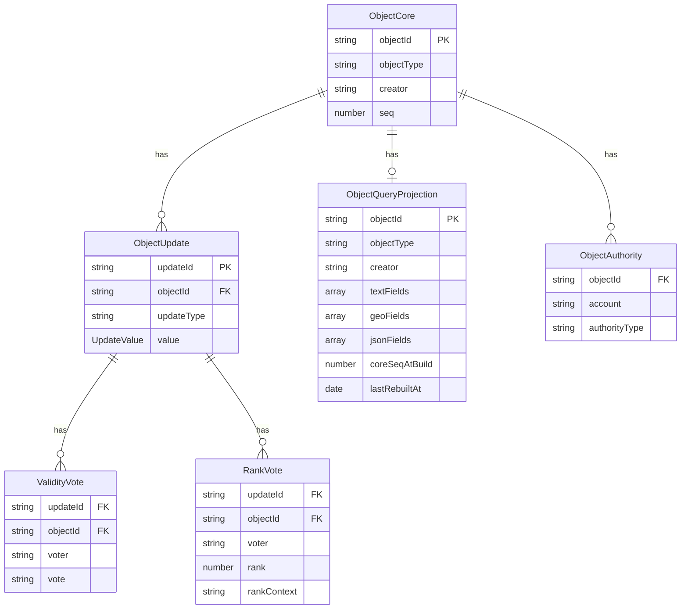
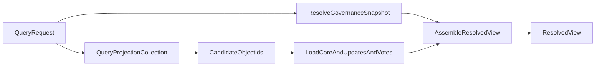

# Mongo Concept v2: Collections and Flow

This document describes the v2 schema (six collections), write flow, read flow, projection strategy, indexes, and consistency model.

Related TypeScript interfaces:

- [shared-types.ts](shared-types.ts) — GeoPoint, CanonicalPosition, UpdateValue, enums
- [objects-core.ts](objects-core.ts) — ObjectCoreDocument
- [object-updates.ts](object-updates.ts) — ObjectUpdateDocument
- [validity-votes.ts](validity-votes.ts) — ValidityVoteDocument
- [rank-votes.ts](rank-votes.ts) — RankVoteDocument
- [object-query-projection.ts](object-query-projection.ts) — ObjectQueryProjectionDocument

## Roles of the collections

| Collection | Role |
|------------|------|
| **objects_core** | Slim identity and metadata per object. No embedded arrays. `seq` is incremented on every mutation. |
| **object_updates** | One document per active update. References `objectId`. Holds `value` (text/geo/json). |
| **validity_votes** | One document per active validity vote. References `updateId` and `objectId`. |
| **rank_votes** | One document per active rank vote (multi-value updates). References `updateId` and `objectId`. |
| **object_query_projection** | Derived query helper. Split by value kind (textFields, geoFields, jsonFields). Tracks `coreSeqAtBuild` for drift detection. |
| **object_authority** | One document per `(objectId, account)` authority claim. Written by `object_authority` Hive events (`method: 'add' | 'remove'`). Does not affect `objects_core.seq`. See [authority-entity.md](../authority-entity.md). |

The **resolved view** (final API response) is still computed at request time from core + updates + votes + governance; it is not stored.

### Entity relationship



## Write flow

Writes happen on the index server when events arrive. Content mutations (update_create, update_vote, rank_vote) increment `objects_core.seq` and update the projection. Authority events write directly to `object_authority` without touching seq or the projection.

```mermaid
flowchart LR
  event[IndexerEvent] --> route[RouteByEventType]
  route -->|update_create / update_vote / rank_vote| coreSeq[IncrementCoreSeq]
  coreSeq --> upsert[UpsertUpdateOrVote]
  upsert --> proj[UpdateProjection]
  proj --> done[(Mongo)]
  route -->|object_authority (method add/remove)| authWrite[UpsertOrDeleteAuthority]
  authWrite --> done
```

### Step 1: Increment core seq

For the target object, run an atomic update that increments `objects_core.seq`. This gives a new sequence number for this mutation and is used later for projection sync.

### Step 2: Upsert update or vote

- **update_create**: Insert one document into `object_updates`. For single-cardinality fields, a new update replaces the previous one. The replacement cascade is:
  1. Find the existing update: `object_updates.findOne({ objectId, updateType, cardinality: 'single' })`.
  2. Delete its validity votes: `validity_votes.deleteMany({ updateId: oldUpdateId })`.
  3. Delete its rank votes (defensive): `rank_votes.deleteMany({ updateId: oldUpdateId })`.
  4. Delete the old update document: `object_updates.deleteOne({ updateId: oldUpdateId })`.
  5. `$pull` the old entry from the projection array by `sourceUpdateId`.
  6. Insert the new update document and `$push` the new entry into the projection.
- **update_create (multi)**: Insert one document into `object_updates`. No replacement; multi-cardinality fields accumulate updates.
- **update_vote**: Upsert one document into `validity_votes` (key: `updateId` + `voter`). A remove is a delete of that document.
- **rank_vote**: Upsert one document into `rank_votes` (key: `updateId` + `voter` + `rankContext`).

All of these reference `objectId` so you can query by object when rebuilding or invalidating the projection.

### Authority events (separate path)

- **object_authority (method = 'add')**: Insert one document into `object_authority` (key: `objectId` + `account` + `authorityType`). No-op if already exists.
- **object_authority (method = 'remove')**: Delete the document from `object_authority` matching `objectId` + `account` + `authorityType` of the signing account.

Authority events bypass seq increment and projection update entirely.

### Step 3: Update projection

- **Incremental**: When a single update is added, `$push` one entry into the appropriate array (`textFields`, `geoFields`, or `jsonFields`) and set `coreSeqAtBuild` and `lastRebuiltAt`. When an update is removed, `$pull` the matching entry. When a vote changes, the projection does not store governance state, so no change is required unless the update's value changed.
- **Full rebuild**: When in doubt (e.g. repair, schema change, or after detecting drift), recompute the entire projection from `object_updates` for that `objectId` and replace the projection document. Set `coreSeqAtBuild` to the current `objects_core.seq` and `lastRebuiltAt` to now.

## Read flow to ResolvedView

Reads use the projection to find candidate object IDs, then load core + updates + votes, then resolve governance and assemble the resolved view.



### Step 1: Resolve governance

Resolve the governance snapshot (admins, trusted) and precedence rules. This is request-scoped and not stored in any collection.

### Step 2: Query the projection collection

Use `object_query_projection` to narrow candidates:

- **Geo**: Query `geoFields.valueGeo` (with a 2dsphere index) or a dedicated `geoFields` index.
- **Text**: Query `textFields.valueText` or use a text index on `textFields.valueText`.
- **Exact match**: Use `textFields.exactValueKey` or `jsonFields.exactValueKey` as needed.

Output: set of candidate `objectId`s (and optionally matched `sourceUpdateId`s).

### Step 3: Load core, updates, votes, and authority

For each candidate `objectId`:

- Read the document from `objects_core`.
- Read all documents from `object_updates` where `objectId` matches.
- Read all documents from `validity_votes` where `objectId` matches (or where `updateId` is in the set of update IDs).
- Read all documents from `rank_votes` where `objectId` matches (or where `updateId` is in the set of update IDs).
- Read all documents from `object_authority` where `objectId` matches.

This can be done with separate queries or with aggregation (`$lookup` from a small set of objectIds) depending on driver and performance needs.

### Step 4: Assemble ResolvedView

For each object, using the loaded updates, votes, authority records, and the governance snapshot:

1. **Compute curator set** `C = { ownership holders for (targetId, targetKind) from object_authority } ∩ { governance admins ∪ governance trusted }`.
2. Group updates by `updateType`.
3. Resolve validity per update:
   - If `C` is non-empty, apply curator filter: an update is valid only if its `creator ∈ C` OR it has a positive validity vote from any member of `C`. Updates satisfying neither are treated as invalid regardless of other votes.
   - If `C` is empty, apply normal vote semantics (votes + governance + precedence).
4. Resolve single-cardinality updates (pick one valid value).
5. Resolve multi-cardinality updates and apply ranking.
6. Apply visibility options (e.g. omit rejected if `includeRejected=false`).
7. Shape the API response (ResolvedView).

## Incremental vs full projection rebuild

| Situation | Action |
|-----------|--------|
| New update created | Incremental: `$push` into the correct array in `object_query_projection`, update `coreSeqAtBuild` and `lastRebuiltAt`. |
| Update removed | Incremental: `$pull` by `sourceUpdateId` from the correct array, update version fields. |
| Update value changed | Incremental: find and update the matching element (e.g. with `arrayFilters`), or `$pull` then `$push`. |
| Bulk backfill, repair, or schema change | Full rebuild: recompute projection from `object_updates` for that object and replace the projection document. |
| Drift detected | Full rebuild when `objects_core.seq` > `object_query_projection.coreSeqAtBuild`. |

## Index recommendations

| Collection | Index | Purpose |
|------------|--------|---------|
| **objects_core** | `{ objectId: 1 }` (unique) | Primary lookup. |
| **object_updates** | `{ updateId: 1 }` (unique) | Lookup by update. |
| **object_updates** | `{ objectId: 1, updateType: 1 }` | Load all updates for an object; filter by type. |
| **validity_votes** | `{ updateId: 1, voter: 1 }` (unique) | One active vote per voter per update. |
| **validity_votes** | `{ objectId: 1 }` | Load all validity votes for an object. |
| **rank_votes** | `{ updateId: 1, voter: 1, rankContext: 1 }` (unique) | One rank per voter per context per update. |
| **rank_votes** | `{ objectId: 1 }` | Load all rank votes for an object. |
| **object_query_projection** | `{ objectId: 1 }` (unique) | Primary lookup. |
| **object_query_projection** | `{ "geoFields.valueGeo": "2dsphere" }` | Geo queries. |
| **object_query_projection** | `{ "textFields.valueText": "text" }` (if supported) | Text search. |
| **object_query_projection** | `{ "textFields.updateType": 1, "textFields.exactValueKey": 1 }` | Exact match and type filter. |
| **object_query_projection** | `{ objectType: 1, "textFields.exactValueKey": 1 }` | Type-scoped exact match. |
| **object_query_projection** | `{ objectType: 1, weight: -1 }` | Type-scoped sorted listing. |
| **object_query_projection** | `{ creator: 1 }` | Filter by object creator. |
| **object_authority** | \{ objectId: 1, account: 1 }\ (unique) | Primary key; upsert/delete by event. |
| **object_authority** | \{ objectId: 1, authorityType: 1 }\ | Load all ownership holders for an object (curator set computation). |
| **object_authority** | \{ account: 1 }\ | Find all objects a user holds authority over. |

Splitting text and geo into separate arrays avoids MongoDB's limitation of one text index per collection and keeps 2dsphere and text indexes on distinct paths.

## Projection array trade-off

The projection document still uses embedded arrays (`textFields`, `geoFields`, `jsonFields`). Unlike v1 where votes were nested inside updates (unbounded growth per update), the projection arrays are bounded by the number of active updates per object -- not by the number of votes. In practice, most objects have tens to low hundreds of updates, well within MongoDB's comfortable document size. This is a conscious trade-off: the alternative (a separate projection document per update) would require multi-document joins on every search query, negating the projection's purpose as a fast query surface. If a future use case produces objects with thousands of updates, consider splitting the projection into a separate collection with one row per field.

## Consistency model

- **Core and projection**: Projection is derived from `object_updates` (and thus from the same mutations that update `objects_core.seq`). Use the same write path so that after a successful write, either both core seq and projection are updated, or you have a clear way to repair.
- **Drift detection**: Compare `objects_core.seq` with `object_query_projection.coreSeqAtBuild`. If `seq` > `coreSeqAtBuild`, the projection is stale. A periodic job or an on-read check can trigger a full rebuild for that object.
- **Transactions**: If all six collections are in the same replica set, multi-document transactions can keep core + updates + votes + projection consistent in one logical write. Otherwise, design for eventual consistency and reconciliation via `seq` / `coreSeqAtBuild`.
