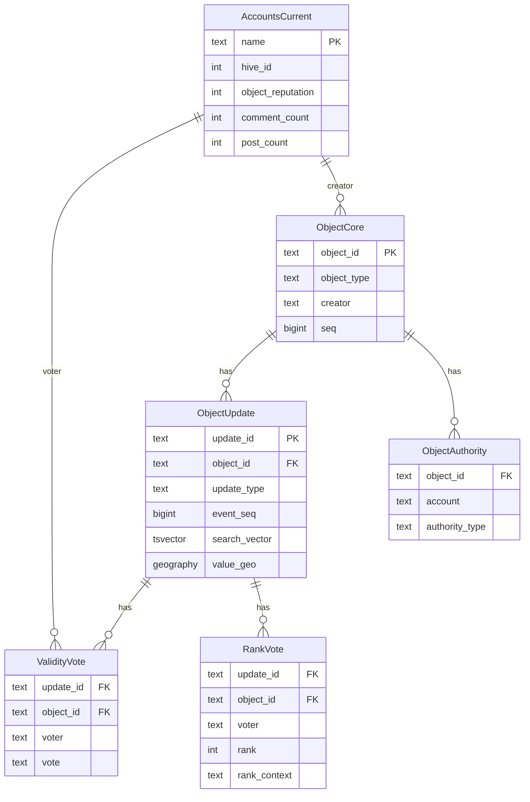
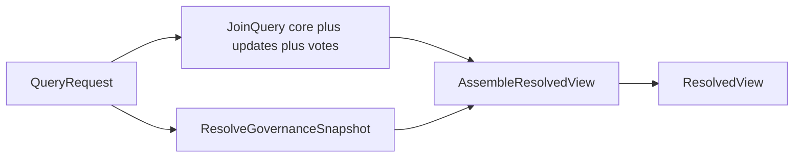

# PostgreSQL Concept: Collections and Flow

This document describes the PostgreSQL schema (four tables), write flow, read flow, and how it compares to [mongo-concept2](../mongo-concept2/). There is **no projection table** — the authoritative tables are queried directly using JOINs, `tsvector` full-text search, and PostGIS.

Related files:

- [shared-types.ts](shared-types.ts) — UpdateCardinality, ValidityVoteValue, ValueKind
- [objects-core.ts](objects-core.ts) — ObjectCoreRow
- [object-updates.ts](object-updates.ts) — ObjectUpdateRow
- [validity-votes.ts](validity-votes.ts) — ValidityVoteRow
- [rank-votes.ts](rank-votes.ts) — RankVoteRow
- [schema.sql](schema.sql) — Full DDL

## Roles of the tables


| Table                | Role                                                                                                                                                   |
| -------------------- | ------------------------------------------------------------------------------------------------------------------------------------------------------ |
| **objects_core**     | Slim identity and metadata per object. `seq` incremented on every mutation.                                                                            |
| **object_updates**   | One row per active update. FK to objects_core ON DELETE CASCADE. Holds value (text/geo/json), plus `search_vector` (tsvector) and PostGIS `value_geo`. |
| **validity_votes**   | One row per validity vote. FK to object_updates ON DELETE CASCADE — replacing an update deletes its votes automatically.                               |
| **rank_votes**       | One row per rank vote. Same CASCADE. rank 1..10000 enforced by CHECK.                                                                                  |
| **object_authority** | One row per `(object_id, account, authority_type)` authority claim. Written by `object_authority` Hive events (`method: 'add' | 'remove'`). Does not affect `seq`. See [authority-entity.md](../authority-entity.md). |
| **accounts_current** | One row per Hive account. Hive-sourced fields synced from Hive node API; `object_reputation` maintained by Indexer from administrative authority events. Used at query time to compute community vote weight. See [social-account-ingestion.md](../social-account-ingestion.md). |


The **resolved view** (final API response) is computed at request time from core + updates + votes + governance; it is not stored.

### Entity relationship




## Write flow

Content mutations (update_create, update_vote, rank_vote) run inside a single transaction. Authority events are a separate write path — no transaction needed, no `seq` increment.

```mermaid
flowchart LR
  event[IndexerEvent] --> route[RouteByEventType]
  route -->|update_create / update_vote / rank_vote| txn["BEGIN"]
  txn --> coreSeq[IncrementCoreSeq]
  coreSeq --> upsert[UpsertUpdateOrVote]
  upsert --> commit["COMMIT"]
  commit --> done[(PostgreSQL)]
  route -->|object_authority (method add/remove)| authWrite[UpsertOrDeleteAuthority]
  authWrite --> done
```


### Step 1: Upsert core row and increment seq

An object may not exist yet when the first event arrives. Use an upsert to create or increment atomically:

```sql
INSERT INTO objects_core (object_id, object_type, creator, weight, meta_group_id, seq)
VALUES ($1, $2, $3, $4, $5, 1)
ON CONFLICT (object_id) DO UPDATE SET seq = objects_core.seq + 1;
```

### Step 2: Upsert update or vote

- **update_create**  
`INSERT INTO object_updates (...)`. The trigger sets `search_vector` from `value_text`.
Cardinality (`single` vs `multi`) is a property of the `update_type` defined in the application-level update registry; it determines how the resolved view picks values at read time, not how rows are stored. Multiple rows for the same `(object_id, update_type)` can coexist — the Query Service resolves the winner.
- **update_vote**  
`INSERT INTO validity_votes (...) ON CONFLICT (update_id, voter) DO UPDATE SET vote = EXCLUDED.vote, ...`
- **rank_vote**  
`INSERT INTO rank_votes (...) ON CONFLICT (update_id, voter, rank_context) DO UPDATE SET rank = EXCLUDED.rank, ...`

All in the same transaction as the seq increment.

### Authority events (separate path)

- **object_authority (method = 'add')**: `INSERT INTO object_authority (object_id, account, authority_type) VALUES ($1, $2, $3) ON CONFLICT (object_id, account, authority_type) DO NOTHING`
- **object_authority (method = 'remove')**: `DELETE FROM object_authority WHERE object_id = $1 AND account = $2 AND authority_type = $3`

Executed outside any transaction together with content events.

#### Reputation side-effect for `administrative` authority

When `authority_type = 'administrative'`, the Indexer must update `accounts_current.object_reputation` for the target object's creator:

- **add**: Look up `objects_core.creator` for the target object. If the signing user differs from the creator and this is the first `administrative` claim by this user on any object by this creator, increment `accounts_current.object_reputation` for the creator.
- **remove**: After deleting the authority row, check if the removed user still holds `administrative` authority on any other object by the same creator. If none remain, decrement `accounts_current.object_reputation` by 1.

See [social-account-ingestion.md § 4.2](../social-account-ingestion.md#42-object_reputation-maintenance) for the full maintenance algorithm and verification query.

### Step 3: No projection

The authoritative tables are the query surface. No separate projection table to maintain.

## Read flow to ResolvedView

Single query path: resolve governance, then one JOIN query that returns core + updates + votes for the matching objects.




### Step 1: Resolve governance

Same as Mongo: resolve admins, trusted, precedence. Request-scoped, not stored.

### Step 2: Query with filters

Use the appropriate filter on `object_updates`, then JOIN to load full data.

**Full-text search (candidates by text):**

```sql
SELECT DISTINCT ou.object_id
FROM object_updates ou
WHERE ou.search_vector @@ to_tsquery('english', $1);
```

**Geo proximity (candidates by location):**

```sql
SELECT DISTINCT ou.object_id
FROM object_updates ou
WHERE ou.value_geo IS NOT NULL
  AND ST_DWithin(ou.value_geo, ST_MakePoint($lon, $lat)::geography, $meters);
```

**Exact match by field type (case-insensitive, uses generated column):**

```sql
SELECT DISTINCT ou.object_id
FROM object_updates ou
WHERE ou.update_type = $1 AND ou.value_text_normalized = LOWER(TRIM($2));
```

**Type-scoped + sorted (e.g. list places by weight):**

```sql
SELECT oc.object_id, oc.object_type, oc.creator, oc.weight, oc.seq
FROM objects_core oc
WHERE oc.object_type = $1
ORDER BY oc.weight DESC NULLS LAST
LIMIT $2 OFFSET $3;
```

### Step 3: Load core, updates, votes, authority, and voter reputations (six targeted queries)

A single multi-way JOIN produces a Cartesian product: if one update has 5 validity votes and 3 rank votes it generates 15 rows per update, requiring complex deduplication in the application. Use six separate queries instead:

```sql
-- 1. Core rows
SELECT * FROM objects_core WHERE object_id = ANY($objectIds);

-- 2. Updates
SELECT * FROM object_updates WHERE object_id = ANY($objectIds);

-- 3. Validity votes
SELECT * FROM validity_votes WHERE object_id = ANY($objectIds);

-- 4. Rank votes
SELECT * FROM rank_votes WHERE object_id = ANY($objectIds);

-- 5. Authority claims
SELECT * FROM object_authority WHERE object_id = ANY($objectIds);

-- 6. Voter reputations (for community vote weight, section C of vote-semantics)
SELECT name, object_reputation
FROM accounts_current
WHERE name = ANY($voterNames);
```

All six can be sent as a pipeline (single round-trip on most drivers). The application joins them in memory by `object_id`, `update_id`, and voter `name`. Query 6 uses the set of distinct voter names collected from queries 3 and 4.

### Step 4: Assemble ResolvedView

For each object, using the loaded rows, authority records, voter reputations, and the governance snapshot:

1. **Compute curator set** `C = { ownership holders for object_id from object_authority } ∩ { governance admins ∪ governance trusted }`.
2. Group updates by `update_type`.
3. Resolve validity per update (tiered):
   - If `C` is non-empty, apply curator filter: an update is valid only if its `creator ∈ C` OR it has a positive validity vote from any member of `C`. Updates satisfying neither are treated as invalid regardless of other votes.
   - If `C` is empty, apply the full validity resolution hierarchy:
     1. **Admin decisive vote** — latest admin `for`/`against` wins (LWAW). Short-circuit.
     2. **Trusted decisive vote** — latest trusted `for`/`against` wins, only on objects the trusted user has authority over (LWTW). Short-circuit.
     3. **Community vote weight** — for each non-admin, non-trusted validity vote, compute `votePower = 1 + log₂(1 + object_reputation)` using the voter's `object_reputation` from `accounts_current`. Sum: `field_weight = Σ (votePower × sign)` where `for → +1`, `against → −1`. If `field_weight < 0` the update is INVALID; if `field_weight >= 0` the update is VALID.
     4. **No votes** — baseline VALID.
4. Resolve single-cardinality update types (pick one valid value per the update registry).
5. Resolve multi-cardinality update types and apply ranking.
6. Apply visibility options (e.g. omit rejected if `includeRejected=false`).
7. Shape the API response (ResolvedView).

See [vote-semantics.md § C](../vote-semantics.md#c-community-vote-weight) for the complete community weight specification.

## Index strategy


| Table          | Index                                               | Type             | Purpose                                   |
| -------------- | --------------------------------------------------- | ---------------- | ----------------------------------------- |
| objects_core   | object_id                                           | PK / B-tree      | Primary lookup                            |
| objects_core   | (object_type, weight DESC)                          | B-tree           | Type-scoped sorted listing                |
| objects_core   | (creator)                                           | B-tree           | Filter by creator                         |
| object_updates | update_id                                           | PK / B-tree      | Lookup by update                          |
| object_updates | (object_id, update_type)                            | B-tree           | Load updates for an object                |
| object_updates | search_vector                                       | GIN              | Full-text search                          |
| object_updates | value_geo                                           | GiST             | Geo proximity                             |
| object_updates | (update_type, value_text)                           | B-tree (partial) | Raw exact match by field type             |
| object_updates | (update_type, value_text_normalized)                | B-tree (partial) | Case-insensitive exact match              |
| validity_votes | (update_id, voter)                                  | UNIQUE           | One vote per voter per update             |
| validity_votes | (object_id)                                         | B-tree           | Bulk load votes for an object             |
| rank_votes       | (update_id, voter, rank_context)                    | UNIQUE           | One rank per voter per context                          |
| rank_votes       | (object_id)                                         | B-tree           | Bulk load ranks for an object                           |
| object_authority | (object_id, account, authority_type)                | UNIQUE           | Primary key; upsert/delete by event.                    |
| object_authority | (object_id, authority_type)                         | B-tree           | Load all ownership holders for an object (curator set). |
| object_authority | (account)                                           | B-tree           | Find all objects a user holds authority over.           |
| accounts_current | name                                                | PK / B-tree      | Primary lookup by account name.                         |
| accounts_current | (object_reputation DESC)                            | B-tree           | Sorted listing by reputation.                           |
| accounts_current | (hive_id)                                           | B-tree (partial) | Lookup by Hive numeric ID (WHERE hive_id IS NOT NULL).  |


## Comparison to Mongo concept v2


| Aspect                     | Mongo concept v2                                               | PostgreSQL concept                                  |
| -------------------------- | -------------------------------------------------------------- | --------------------------------------------------- |
| Tables/collections         | 6 (core, updates, validity_votes, rank_votes, projection, authority) | 6 (core, updates, validity_votes, rank_votes, authority, accounts_current; no projection) |
| Projection                 | Separate document/table, must be kept in sync                  | None; query core tables directly                    |
| Single-cardinality resolve | Manual cascade: delete votes, delete update, update projection | Read-time resolution via update registry; no DB-level enforcement |
| Consistency                | seq + coreSeqAtBuild for drift detection                       | ACID; seq for change tracking only                  |
| Text search                | Projection searchText or text index on projection              | tsvector + GIN on object_updates                    |
| Geo search                 | Projection geoFields + 2dsphere                                | PostGIS geography + GiST on object_updates          |
| Read path                  | Two-hop: query projection → load core + updates + votes        | One-hop: filtered JOIN over core + updates + votes  |
| Writes                     | Core seq → upsert → update projection (incremental or full)    | Transaction: seq → upsert; no projection write      |

### Why can't Mongo use the same approach? (Search by updates with indexes, then join)

You can do part of it — in Mongo v2 you can query `object_updates` directly with indexes, since there are no embedded arrays. Three hard blockers make it fall short of the PostgreSQL approach.

**1. `$text` and `$near` cannot be combined in the same MongoDB query**

This is a MongoDB limitation. Putting both in the same filter returns an error:

```javascript
// Illegal in MongoDB:
db.object_updates.find({
  $text: { $search: "central park" },
  value: { $near: { $geometry: { ... } } }
});
```

PostgreSQL has no such restriction: both `search_vector @@ to_tsquery(...)` and `ST_DWithin(...)` can live in the same WHERE clause. That is why the Mongo projection splits `textFields` and `geoFields` into separate arrays — each can be indexed independently; compound text+geo queries require two candidate sets and application-side intersection.

**2. Compound queries across object metadata need denormalization or `$lookup`**

In PostgreSQL you can write:

```sql
SELECT ou.object_id
FROM object_updates ou
JOIN objects_core oc ON oc.object_id = ou.object_id
WHERE oc.object_type = 'place'
  AND ou.search_vector @@ to_tsquery('english', 'park');
```

The planner pushes both predicates through the JOIN and uses indexes on both sides.

In MongoDB, `objectType` lives in `objects_core` and the text in `object_updates`. To filter on both you must either denormalize `objectType` (and `weight`, `metaGroupId`) into every update document — which is what the projection does — or use `$lookup`, which runs sequentially and cannot push the core predicate into the updates index scan. PostgreSQL's planner can choose hash join, nested-loop index scan, or merge join; Mongo's pipeline runs stage by stage.

**3. The two-hop pattern remains even without a projection**

Even if you query `object_updates` directly in Mongo v2, you still need a second round-trip to load the full core (and votes). PostgreSQL gets everything in one query via JOINs. In Mongo: hop 1 = query updates → get `objectId`s; hop 2 = `objects_core.find({ objectId: { $in: [...] } })` plus separate queries for votes. The projection exists so the first hop can include objectType/creator/weight and avoid loading the core for filtering; PostgreSQL makes that irrelevant because the join is cheap.

**Summary**

| Capability | Mongo v2 (direct updates query) | PostgreSQL |
|------------|--------------------------------|------------|
| Text OR geo (separate) | Works | Works |
| Text AND geo combined | Not supported — illegal | Works |
| Filter by objectType + text in one query | Requires denorm or slow `$lookup` | Works via JOIN |
| Single round-trip for core + updates + votes | No — always 2+ hops | Yes |
| Query planner can reorder JOINs | No — pipeline is sequential | Yes |

For simple single-dimension searches you could query `object_updates` directly in Mongo v2; as soon as you need combined text+geo or any cross-collection filter, you need either a projection or expensive `$lookup` aggregations with no planner optimization.

## Consistency model

- **ACID**: Every content write is one transaction. No drift between “core” and “projection” because there is no projection.
- **CASCADE**: Deleting an object or an update removes dependent rows in child tables automatically. \object_authority\ rows reference \object_id\ and should be removed when the object is deleted (FK with CASCADE or application-side).
- **seq**: Kept for change tracking and optional consumers (e.g. incremental export); not required for correctness.
- **Authority**: Authority events are written outside the content transaction. A failed authority write does not corrupt content state; the event can be replayed safely.


